## Analytics Engineering using [dbt](https://www.getdbt.com)


```python
from IPython.display import display, HTML
display(HTML('<div style="display: flex;"> \
              \
             <div style="float: right; margin-left:3%"> \
             <p style=" font-size: 130%; margin-top:10%; ">By Stamatis Sideris</p> \
             <p style="font-size: 100%;">Updated as of: September 18, 2023</p> \
             </div> \
             </div>'))
```


<div style="display: flex;">                            <div style="float: right; margin-left:3%">              <p style=" font-size: 130%; margin-top:10%; ">By Stamatis Sideris</p>              <p style="font-size: 100%;">Updated as of: September 18, 2023</p>              </div>              </div>


### Table of Contents

[1. Introduction](#introduction)

[2. How does dbt work](#how-does-dbt-work)

[3. Initializing a dbt Project - using CLI](#initializing-a-dbt-project-using-cli)

[4. zInitializing a dbt Project - using dbt Cloud](#initializing-a-dbt-project-using-dbt-cloud)

[5. dbt Basics - Creating and Running a dbt Model ](#dbt-basics-creating-and-running-a-dbt-model)

[6. dbt Basics - Defining Sources ](#dbt-basics-defining-sources)

[7. dbt Basics - Running Tests ](#dbt-basics-running-tests)

[8. dbt Basics - Generating Documentation ](#dbt-basics-generating-documentation)

[9. dbt Basics - Project's Deployment ](#dbt-basics-project's-deployment)

[10. Conclusion](#conclusion)

### Introduction

To start, how would you define an analytics engineer? Analytics engineers focus on the transformation of raw data into transformed data that is ready for analysis. This new role on the data team changes the responsibilities of data engineers and data analysts. In other words, Analytics Engineers work as an intermediate that bridges data engineers and data analysts as they understand both of the underlying infrastructure of data and the business/analytics needs.

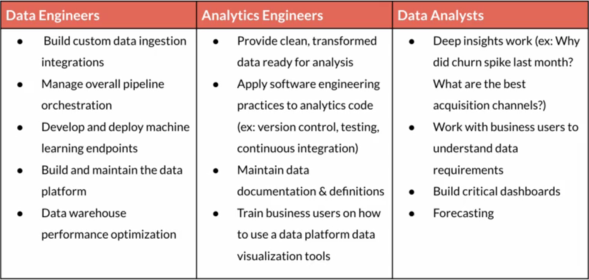 

In this tutorial, we are going to use dbt (data build tool), a transformative framework that has revolutionized the way we engineer analytics. dbt empowers data teams to leverage software engineering principles for transforming data by using SQL modules to model and transform data so that they are available in the correct format for use by the data analysts. dbt is playing a crucial role in the transformation part of the ELT (extract-load-transform) methodology, collecting data from modern Data Platforms and transforming them based on the needs of the analytics teams. Some of dbt's characteristics are:

- Modularization and Reusability: DBT allows you to modularize your SQL code into reusable "models". This makes it easier to maintain and scale your data transformations as your data and business needs evolve.

- Version Control: DBT projects can be version-controlled using Git, which means you can track changes to your data transformations over time, collaborate with team members, and roll back to previous versions if needed.

- Data Testing: DBT provides a framework for writing and running data tests to ensure the quality and consistency of your data. You can create tests to validate data integrity, conformity to business rules, and more.

- Documentation: DBT encourages the documentation of data models and transformations. This helps team members understand the data pipeline and how different data elements are derived and used.

For detailed documentation on dbt refer [here](https://docs.getdbt.com/docs/introduction).

### How does dbt work

In the modern data era, organizations use cloud-based Data Platforms to store their data after extraction, avoiding the pre-transformation step and performing custom transformations afterwards based on analytics needs. This way, data pipelines are becoming more efficient and cost-effective. 

Based on this architecture, dbt's role is to sit on top of the Data Platforms and help on the transformation step. dbt is able to connect to the Data Platform of our choice, detect the databases and schemas stored inside of it, develop models that transform data into new tables and views and store them inside the Data Warehouse, test and version control the developments and finally deploy jobs that automate the data supply to the analytics teams and bring them to production. 

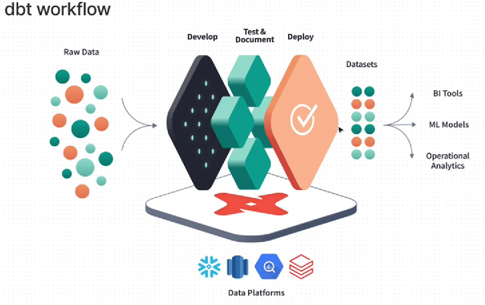

### Initializing a dbt Project - using CLI

We start by creating a virtual environment and pip installing in it the dbt-bigquery libary which is responsible for connecting dbt to Google Cloud's Data Warehouse called BigQuery. For a tutorial on loading BigQuery with the data we are about to use, refer [here](https://github.com/ssideris/Data_Management_Concepts/tree/main/DevOps/Uploading%20Data%20in%20Google%20Cloud%20Storage%20and%20Querying%20them%20using%20Big%20Query). For commands on how to install dbt for different Data Warehouses' providers refer [here](https://docs.getdbt.com/docs/supported-data-platforms).


```python
python3 -m venv dbt-env
source dbt-env/bin/activate
pip install dbt-bigquery
```

We then proceed on initializing our dbt project:


```python
dbt init
```

An interactive prompt will open asking us questions about the configuration of our project. First, the name of our project is needed, i call it "ecommerce_analytics". Then, we are asked to choose the database of our project, for me the only available option is [1] BigQuery. The desired authentication method is that of a service account (Refer [here](https://github.com/ssideris/Data_Management_Concepts/tree/main/DevOps/Uploading%20Data%20in%20Google%20Cloud%20Storage%20and%20Querying%20them%20using%20Big%20Query) for the tutorial on creating a service account, adding the key role BigQuery Admin and downloading the key in json format). Finally, we need to set the path to our .json file, the region of the server we are about to use and the number of threads. In the end, a project directory is created including all the files needed for developing our project. 

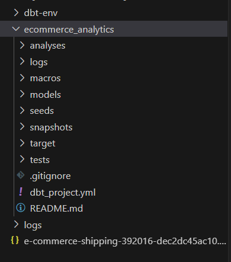 

We use the following command to check if a correct connection has been established with our database:


```python
dbt debug
```

The file dbt_project.yml is responsible for configuring our project. When we open it, we observe the key "profile". Its value is corresponding to the configuration included in the profiles.yml file. The profiles.yml has been created automatically when initializing dbt and can be found inside the home directory and the folder .dbt. Its format is presented below and includes the values we set for each key in the interactive prompt before. We can create more than one profiles inside the same profiles.yml and use the key target to set the name of the profile we want to use for our project.


```python
ecommerce_analytics:
  outputs:
    dev:
      dataset: ecommerce_data
      job_execution_timeout_seconds: 300
      job_retries: 1
      keyfile: /home/sgsid/ecommerce/dbt/e-commerce-shipping-392016-dec2dc45ac10.json
      location: EU
      method: service-account
      priority: interactive
      project: 'e-commerce-shipping-392016'
      threads: 2
      type: bigquery
  target: dev
```

Moreover, we can also change the name of our project on key "name" as well as define if a models' directory will produce exclusively tables or views (we will talk about dbt models later on) on key models.

As a last step, let's connect our project to a Github repository via git for version controlling. To do so, start git inside your project's directory:


```python
git init
```

set your branch:


```python
git branch -m main
```

set the https url to the repository:


```python
git remote add origin https://github.com/ssideris/dbt-test.git
```

and commit your projet to the repo:


```python
git add .
git commit -m "Initial commit"
git push origin main
```

The project should be loaded on Github.

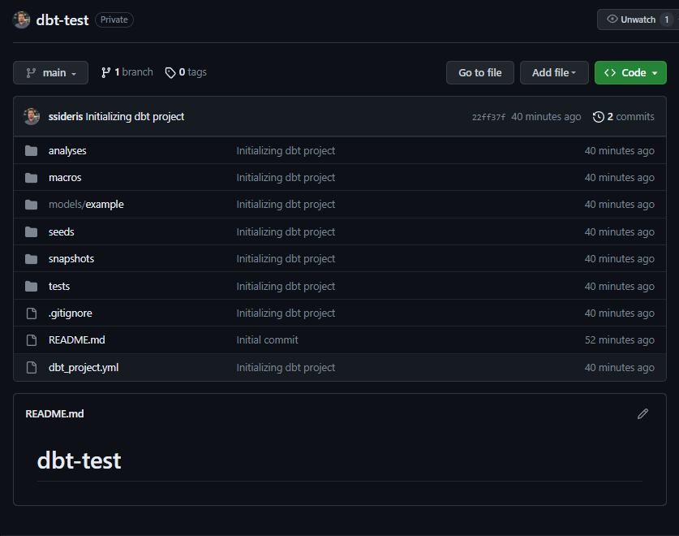 

### Initializing a dbt Project - using dbt Cloud

dbt Cloud is a hosted version that streamlines development with an online Integrated Development Environment (IDE) and an interface to run dbt on a schedule. To start, visit the following hyperlink [dbt-cloud](https://www.getdbt.com) and create a free account. 

Let's set a name for our project and choose BigQuery as connection. Then, we upload the key.json of our service account, which is similar to the one we used in the CLI installation.

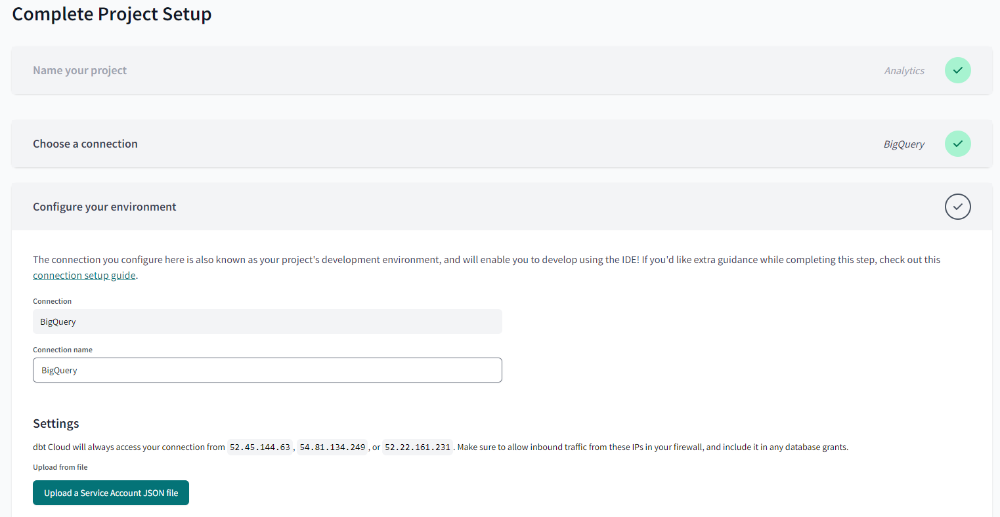 

A connection should be established:

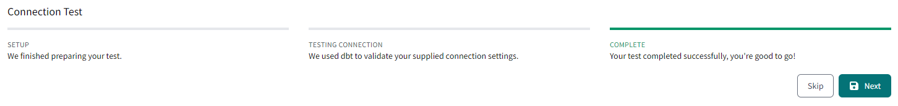 

Afterwards, we are provided with numerous options on where to store our dbt project. As a best practise, we will choose a repository on Github but you could also store the project on dbt cloud, gitLab or even git clone an existing project from Github. Github will ask for permission to connect your account and preferred repo to dbt.

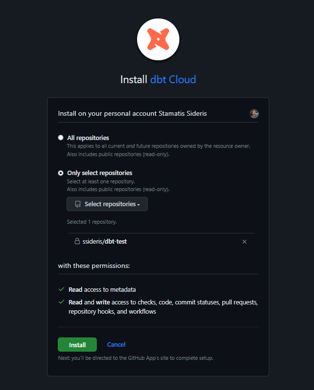 

Initialize the project by selecting "initialize dbt project" on the left panel and proceed on commiting the changes.

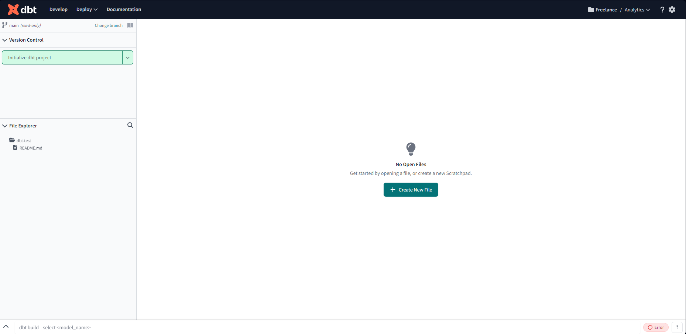 

The dbt project's files should have been pushed on github.

 

### dbt Basics - Creating and Running a dbt Model 

dbt is using SQL DDL/DML Statements to transform data. dbt models are SQL files or SQL code snippets that define how raw or source data should be transformed into structured and analytically useful datasets. Let's create our first model that will read our table inside BigQuery and filter the events for the months January and December.

To do so, we first create a events directory inside the models directory. There, we create a .sql file which we will call "events_jan_dec". Inside it, we write the following SQL snippet. The first line is using a Jinja statement (dbt is supporting Jinja) to configure if the result of the query will be stored as a table or as a view, a step which we can bypass by parameterizing the dbt_project.yml we referred to before.


```python
{{ config(materialized='table') }}
WITH events_jan_dec AS (
    SELECT * FROM `e-commerce-shipping-392016.ecommerce_data.ecommerce_data_all_partitioned_clustered`
    WHERE EXTRACT(MONTH FROM date) IN (1,12)
)

SELECT date, event_type, product_id, price, user_id, FROM events_jan_dec
```

Moreover, we create another .sql file with the following SQL script and we name it "events_jan_dec_5676290.sql". The script is calling the table created in the model "events_jan_dec" using the ref function and filter it for a specific product id. The ref function is helping to modularize our scripts avoiding repeating the same code and making the code more managable and reusable for other developments. As we do not configure the result of the code, a model view is automatically created. The difference of view from table is that a view is just a virtual table that does not store data itself but represents an SQL code snippet that calls and displays a substract of data from a table or another view  while a table is a physical database object that stores data in a structured format. 


```python
SELECT * FROM {{ ref('events_jan_dec') }}
WHERE product_id = 5676290
```

In order to execute our models, we use the following command: 


```python
dbt run
```

The models are executed based on their dependencies. The feedback on the terminal should look like this in case of successful completion.

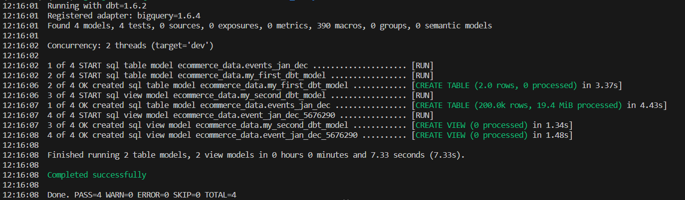 

Moreover, a model table and a model view must have been created in the BigQuery dataset based on our 2 models.

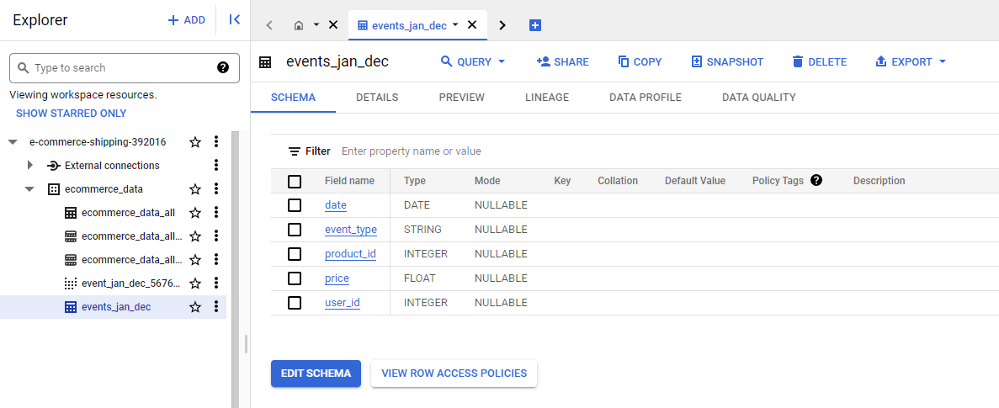 

The modularity of our work can been observed also by opening the "LINAGE VIEW" inside our terminal. There we can see that the model "events_jan_dec" works as a parent model and is running first over the "event_jan_dec_5676290" as we use the ref function inside the second one to call the first one.

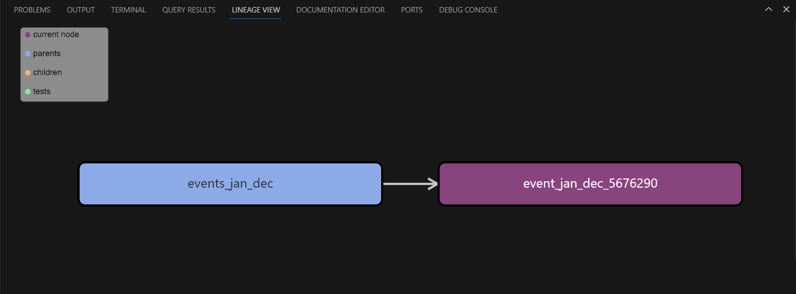 

dbt is allowing as to alter the schema of the produced tables. To do so, we create a schema.yml file inside our models directory and we write out the following:


```python
version: 2

models:
  - name: events_jan_dec
    description: "A model that exctracts the event for December and January"
    columns:
      - name: product_id
        description: "The product's id"
        tests:
          - not_null
  
  - name: events_jan_dec_5676290
    description: "A model that exctracts the event for December and January and Product ID 5676290"
```

By doing this, we are telling dbt that the table result of model events_jan_dec should include a non nullable column product_id. If not, then the table is not created. We will talk more about tests on one of the next paragraphs. Moreover, a description of the models is added for explainability allowing us to document the tables inside the Data Platform.

Finally, let's push our changes on Github for version controlling. We create a new branch for development as a best practise and we push.


```python
git add .
git commit -m "Add first two models"
git push origin dbt_dev
```

### dbt Basics - Defining Sources

Sources refer to the data connectors or configurations that allow you to access and query data from various data warehouses or databases. DBT can connect to different sources to extract data, transform it, and load it into your data warehouse for analytics and reporting purposes.

In order to configure a source in dbt, we use yaml files. To start, let's create an events_raw.yml inside our models directory. Inside it we write out the following configuration:


```python
version: 2

sources:
  - name: ecommerce_data
    database: e-commerce-shipping-392016  
    tables:
      - name: ecommerce_data_all_partitioned_clustered
        loaded_at_field: event_time
        freshness:
          warn_after: {count: 12, period: hour}
          error_after: {count: 14, period: hour }
```

The configuration is telling dbt to find the database ecommerce_data inside our Data Platform, take the table ecommerce_data_all_partiotined_clustered and create a source based on that table. This way, we are able to call the source in our scripts without saving the table somewhere other than our Data Platform.

Moreover, dbt is allowing us to warn ourselves of when our source has not been refreshed over a specific period of time or even raise an error when the source is called and stop the models that are using it from running. The freshness is checked based on the load_at_field value which must be a column of our source dataset and of type timestamp.

To use the source table you simply make use of the following source function inside a model:


```python
WITH source AS (
SELECT * FROM {{ source('events', 'ecommerce_data_all_partitioned_clustered') }}
)
```

To check for the freshness of the sources use:


```python
dbt source freshness
```

### dbt Basics - Running Tests

Tests are helping us to prepare consistent models that are ready to get in production. They allow us to make specific assertions on how we want our data to be modified and keep them consistent through out our project. For example, we have already seen the use of not_null test and how it parameterizes our table/view so that a column to not be allowed to have null values in it. 

Tests are separated into two categories, Generic and Singular. The Generic Tests are written in YAML and return the number of records that do not meet your assertions. These are run on specific columns in a model. Some examples are:

- Unique tests to see if every value in a column is unique
- Not_null tests to see if every value in a column is not null
- Accepted_values tests to make sure every value in a column is equal to a value in a provided list
- Relationships tests to ensure that every value in a column exists in a column in another model

In the following example, we are testing before running that the column product_id is not having null values and that all its values are unique. Moreover, we are testing that the column event_type is including only the values purchase, cart, view and remove_from_cart.


```python
models:
  - name: events_jan_dec
    description: "A model that exctracts the event for December and January"
    columns:
      - name: product_id
        description: "The product's id"
        tests:
          - not_null
          - unique
      - name: event_type
        description: "The type of the event"
        tests:
          - accepted_values:
              values:
                - purchase
                - cart
                - view
                - remove_from_cart
```

To run the test on the model we run the command:


```python
dbt test --select events_jan_dec
```

The results are showing as an error on the uniqueness of the product_id as not all rows have unique product_id values.

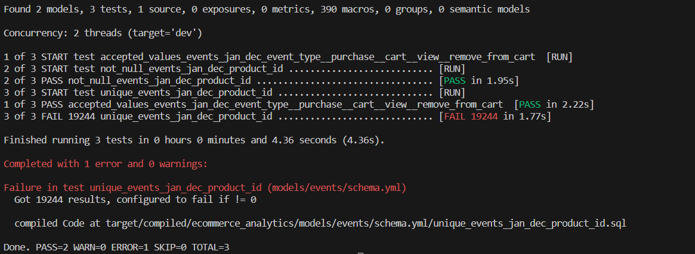

On the other hand, singular tests are stored as select statements in the tests folder. For example, let's run a test where we will check if the price column has negative values. To do so, let's create the following model and call it "negative_total_price_test":


```python
WITH events_jan_dec AS (
    SELECT * FROM {{ ref('events_jan_dec') }}
    WHERE EXTRACT(MONTH FROM date) IN (1,12)
)

SELECT product_id, SUM(price) AS total_price FROM events_jan_dec
GROUP BY 1
HAVING total_price < 0
```

To run the test we use again the command:


```python
dbt test --select negative_total_price_test
```

The test was successfully passed:

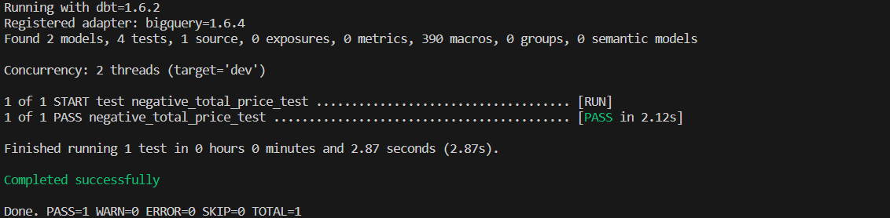

As a last tip, tests can be performed on sources too by adding the appropriate keys at the source yaml files inside models folder. As an example:

### dbt Basics - Generating Documentation

As we have already noticed, dbt is giving us the opportunity to use the key 'description' in order to add documentation to our models and sources. dbt is also giving as the ability to write more descriptive documentation by using doc blocks. A doc block is a markdown file that is called from the doc function and provides us with markdown documentation. For example, let's create a .md doc file inside the models folder that includes the following text.


```python

	
One of the following values: 

| status           | definition                                       |
|------------------|--------------------------------------------------|
| purchase         | Order placed                                     |
| cart             | Order placed in cart                             |
| view             | Product has been observed                        |
| remove_from_cart | Product was removed from cart                    |


```

In order to generate the documentation, we use the command:


```python
dbt docs generate
```

By doing that, dbt clous is able to collect all the descriptions inside you project and create a markdown file with the documentation inside your project. We are able to read the documentation by pressing the `view docs` link in the top left corner of the Cloud IDE.

The generated documentation includes the following:
- Lineage Graph
- Model, source, and column descriptions
- Generic tests added to a column
- The underlying SQL code for each model
- and more...

### dbt Basics - Project's Deployment

Deployment in dbt (or running dbt in production) is the process of running dbt on a schedule in a deployment environment. The deployment environment will typically run from the default branch (i.e., main, master) and use a dedicated deployment schema (e.g., dbt_prod). The models built in deployment are then used to power dashboards, reporting, and other key business decision-making processes.

In order to build a deployment environment, we open our project on dbt cloud and visit the deploy-environments tab. There, we click to create a new environment.

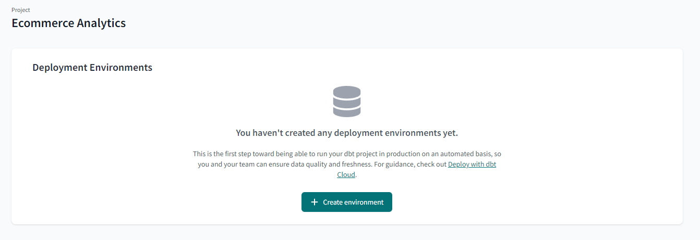

Then, we set a name for our environmeent, we set it as production environment and we complete the needed credentials in order to connect to our data platform. In our case, authentication is not needed as we have used a service account for connecting to our platform which is also the best practice.

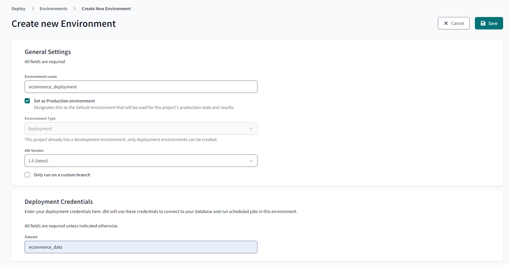

We then proceed on creating a job. First, visit the deploy-jobs tab.

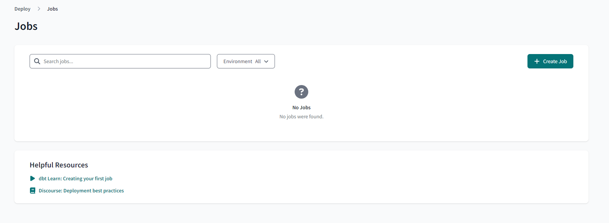

There we set a name for our job, we choose the environment we created previously and we choose to generate docs automatically as well as to run source freshness before any other step in the job. We set the command to "dbt build" as it is a command that will perform all the runs and tests inside our project. Finally, we schedule our job to run every day at 4 am UTC.


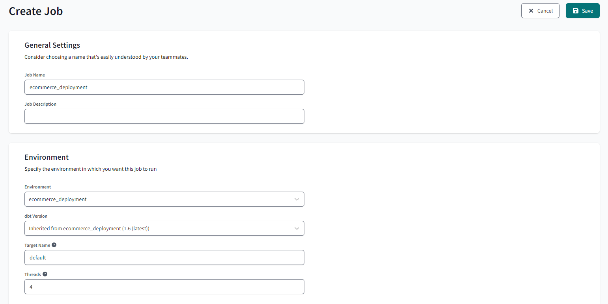

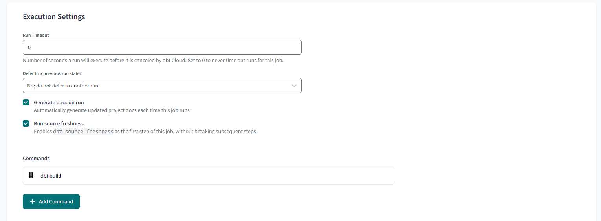

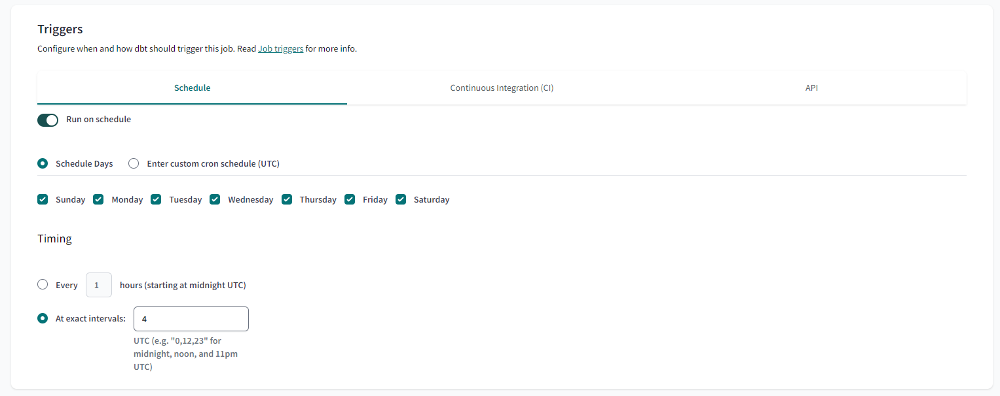

### Conclusion

In conclusion, this tutorial has provided a comprehensive overview of the basics of using dbt (data build tool) to transform and manage data within your organization. We began by understanding the core concepts behind dbt, including modeling, transformations, and the importance of version control. We then delved into the practical aspects of setting up and configuring dbt, creating models and tests, and deploying the transformed data to your target destination.
