# [Virtual Machine Instance](https://cloud.google.com/compute/docs/instances) in [Google Cloud](https://cloud.google.com/docs/overview)


<!--
```python
from IPython.display import display, HTML
display(HTML('<div style="display: flex;"> \
              \
             <div style="float: right; margin-left:3%"> \
             <p style=" font-size: 130%; margin-top:10%; ">By Stamatis Sideris</p> \
             <p style="font-size: 100%;">Updated as of: May 4, 2023</p> \
             </div> \
             </div>'))
```
-->

<div style="display: flex;">                            <div style="float: right; margin-left:3%">              <p style=" font-size: 130%; margin-top:10%; ">By Stamatis Sideris</p>              <p style="font-size: 100%;">Updated as of: May 4, 2023</p>              </div>              </div>


-------------------------------------------------------------------------------------------------------------------------------

### Table of Contents

[1. Introduction](#introduction)

[2. Tech Stack](#tech-stack)

[3. VM Instance Installation using Google Cloud](#vm-instance-installation-using-google-cloud)

[4. Google Cloud Service Account Creation](#google-cloud-service-account-creation)

[5. Conclusion](#conclusion)

### Introduction

In this tutorial, I will guide you through the process of setting up a new VM instance ([What is a VM Instance?](https://www.vmware.com/topics/glossary/content/virtual-machine.html)) using the Google Cloud Console ([and what is a Google Cloud Console?](https://cloud.google.com/docs/overview)). We will cover the essential steps of configuring the VM instance, choosing the appropriate machine type, selecting the operating system, and setting up network and storage options as well as authenticating the users that have access to it.

By the end of this tutorial, you will have the necessary skills to set up your own VM instances and take advantage of the many benefits that Google Cloud has to offer. So, let's get started!

### Tech Stack

• Local OS: Windows 11

• VM Instance OS: Linux/Ubuntu 

### VM Instance Installation using Google Cloud

We visit the Google Cloud webpage and connect to our Google account. After that, we click on the Console. From there, we choose to create a new Project and we give it a name of our preference. Google offers 24 free projects to run per account as well as 300$ of free credits for 3 months for every new account.


Moving forward, we go Compute Engine -> VM Instance from the menu on the left. 

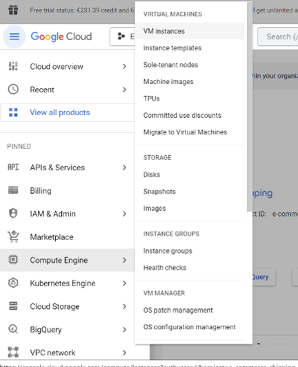

We choose to create a new instance and we give it the name of our choice. We could also choose the region we want the server we connect to be located for better connectivity, the machine type to use as of its CPU and RAM requirements as well as the disk storage and the operating system. Here, we choose the Belgium region, on a 4 vCPU and 8gb RAM machine of 10gb disk storage, running Ubuntu. 

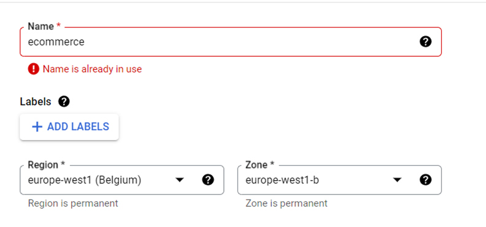


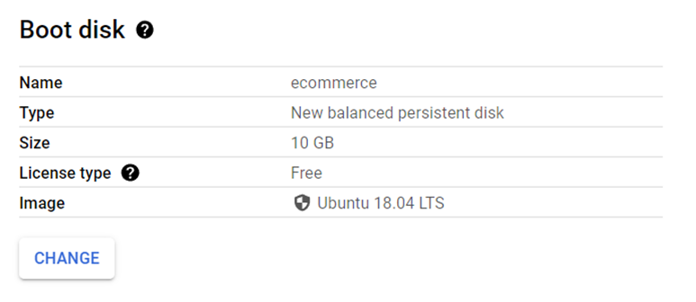

We continue on our terminal. Here, we use the GitBash terminal for windows offered by Git but you could use any other type of terminal in the operating system of your choice. Of course, some steps, paths and commands might vary depending on the operating system you are working with. 

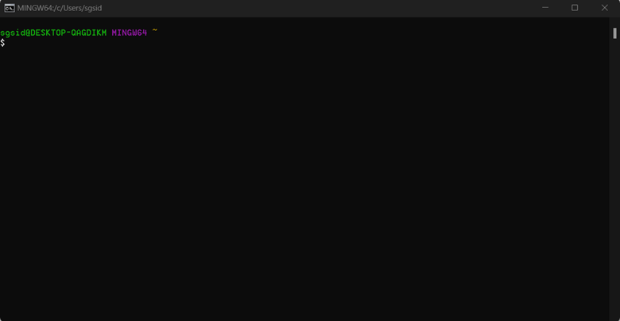

Firstly, we create a .ssh directory with the mkdir command. Here, we will store the ssh key. SSH keys are an authentication method used to gain access to an encrypted connection between systems and then ultimately use that connection to manage the remote system.  


In order to generate the key we use the following command:
ssh-keygen -t rsa -f C:\Users\WINDOWS_USER\.ssh\KEY_FILENAME -C USERNAME -b 2048
where WINDOWS_USER is your username on the windows machine, KEY_FILENAME is the name for your SSH key file and USERNAME is your username in the VM.


A private key file (gcp_1) and a public key file (gcp_1.pub) are generated inside the .ssh directory. Never share your private key file with anyone as it will provide someone with access to your VM instance. The one to be shared is the public key file gcp_1.pub where a hashed key is presented.


We open the public key file using the command cat and copy the public SSH key.


Next, we revisit our VM instance and this time we choose Metadata from the menu on the left. We choose the SSH KEYS option and add there our public SSH key we copied previously.

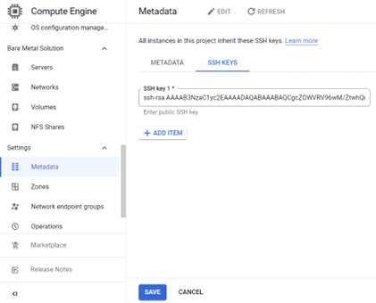

Now, we are ready to connect our local machine to the VM instance using the SSH network. To do so, we will use the code editor Visual Studio Code (VS).

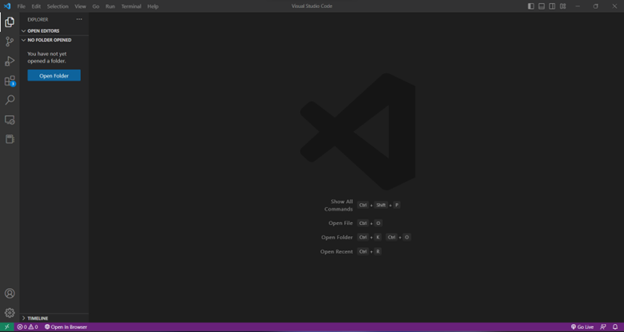

We visit the extensions on the left and search for the Remote – SSH extension to install. The extension will help as configure the connection between our local machine and the virtual machine.

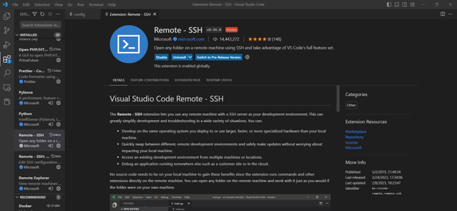

In order to configure we need a config directory that includes all the information needed. We create one via our terminal and open it with the command code.


The directory opens via our default code editor which must be set as Visual Studio Code. Set the info with the following structure where Host is the name of the VM, HostName the external IP address of the VM, User the username you use as user for the VM and IdentityFile the local path to your private SSH key. Save the file.


Continue by choosing the green icon on the bottom left of VS and choose “Connect to host” from the drop-down menu opening. Choose the name of your Host and connect. 

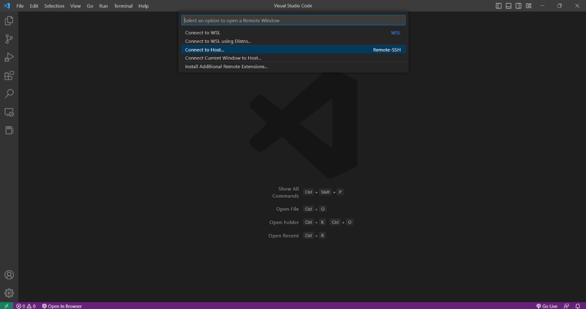


That’s it! You are connected to a Virtual Machine Instance of your preference provided by Google.

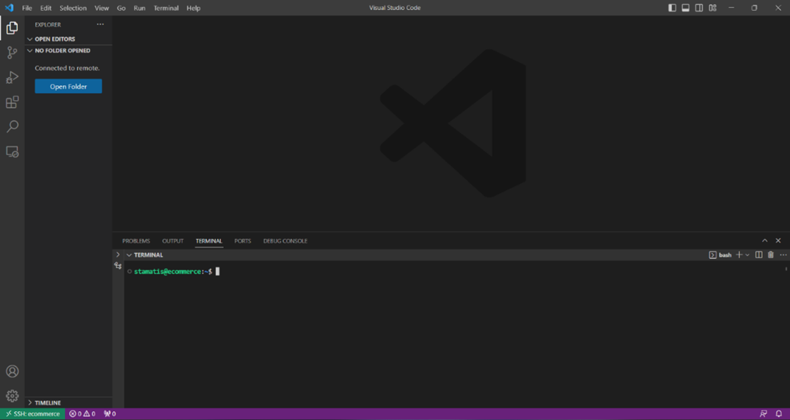


### Google Cloud Service Account Creation

The Service Account is a special type of Google account intended to represent a non-human user that needs to authenticate and be authorized to access data in Google APIs. Typically, service accounts are used in scenarios such as: Running workloads on virtual machines (More info [here](https://cloud.google.com/iam/docs/service-account-overview)). 
At first, we visit Google Cloud and choose the IAM & Admin -> Service Accounts -> CREATE SERVICE ACCOUNT from the menu on the left. 

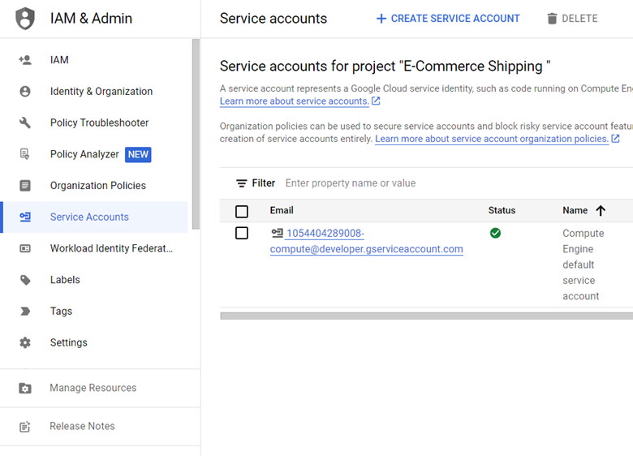

Set a name of your choice, the Role to Viewer and create your account. The new Service Account should be displayed in Service Accounts page.

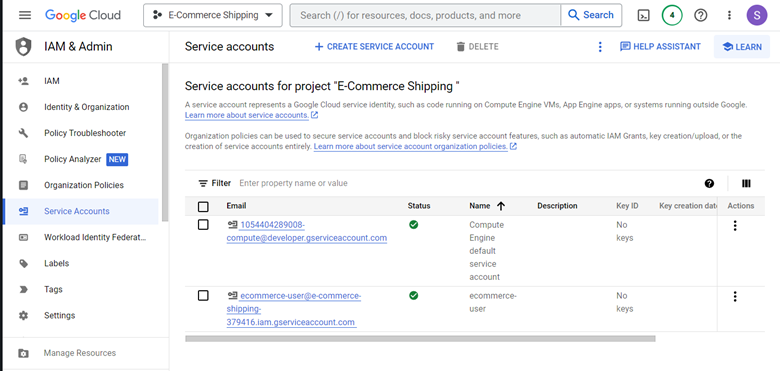

We click the 3 bullets on the right of the service account we just created and choose the option “Manage Keys”. From there, we choose ADD KEY -> Create new key and we set the key type to JSON. This way we download locally the private key needed to use this service account.


As we are using a VM instance, we need to move the JSON file from our local environment to the VM to use it there. To do so, we visit again the Google Cloud and the VM instances option. We click on the SSH button of our VM instance and a SSH-in-browser window pops up. In case that more than one user exist in our Linux instance, it is possible that the Linux username presented differs from the one we want to use. We can change it by clicking on the settings button at the top right corner and selecting “Change Linux Username”. There we type our preferred username so that the uploaded files are uploaded to the correct user. We click on UPLOAD FILE and upload the JSON file which is located in our default folder for downloading files.    

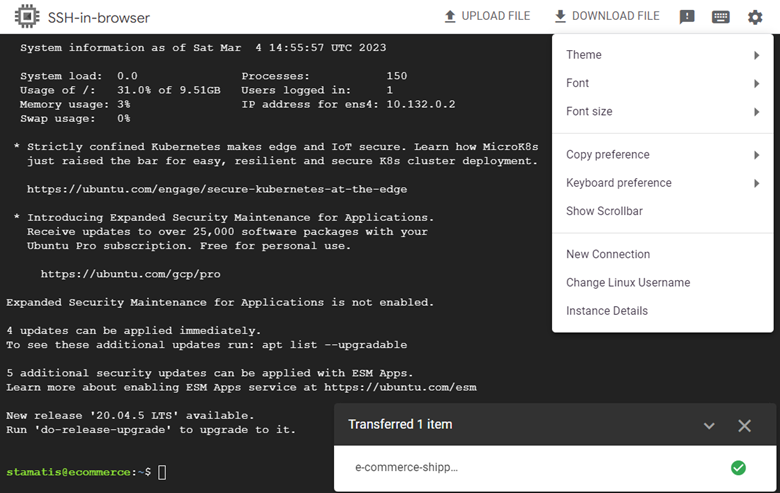

Back in our VM’s terminal, we create a new directory called keys and move the private key there for organization reasons.


We will now use the Google Cloud Client to configure our connection to the service account. Our VM instance already includes Google Cloud Client and so there is no need to download it. By using the following command, we set the environment variable to point to our downloaded GCP auth-key and then we login to the service account.


We then follow the instructions displayed and in the end, we should be connected to our service account.


Back to Google Cloud, we are able to change the roles and authorization our user has in order to allow them have access to different services of the cloud. To do so, we visit our service account by going to IAM & Admin -> ΙΑΜ and we choose the pencil button next to our service account. There, for example, we choose to add 3 new roles, one for Storage Admin, one for Storage Object Admin and one for BigQuery Admin. 

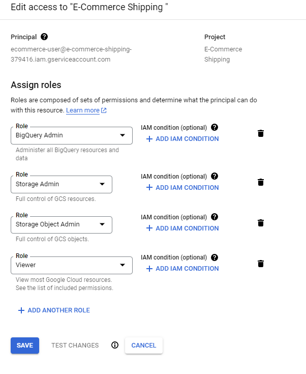

As a final step, we need to enable two APIs found here:

https://console.cloud.google.com/apis/library/iam.googleapis.com?project=ivory-lotus-374512

https://console.cloud.google.com/apis/library/iamcredentials.googleapis.com?project=ivory-lotus-374512

They manage identity and access control for Google Cloud Platform resources, including the creation of service accounts, which you can use to authenticate to Google and make API calls.


### Conclusion

Through this tutorial, we have covered the essential steps required to set up a new VM instance. With Google Cloud's easy-to-use console and comprehensive set of tools, you can quickly spin up a new VM instance and start working on your project without the need to worry about hardware maintenance, software updates, or network configuration.
