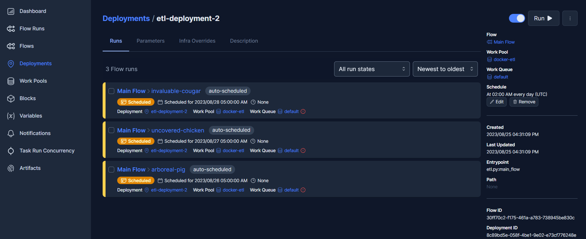

## Flow-as-a-Code [Deployment](https://docs.prefect.io/2.11.3/concepts/deployments/) using Prefect

<!--
```python
from IPython.display import display, HTML
display(HTML('<div style="display: flex;"> \
              \
             <div style="float: right; margin-left:3%"> \
             <p style=" font-size: 130%; margin-top:10%; ">By Stamatis Sideris</p> \
             <p style="font-size: 100%;">Updated as of: August 6, 2023</p> \
             </div> \
             </div>'))
```
-->

<div style="display: flex;">                            <div style="float: right; margin-left:3%">              <p style=" font-size: 130%; margin-top:10%; ">By Stamatis Sideris</p>              <p style="font-size: 100%;">Updated as of: August 6, 2023</p>              </div>              </div>


### Table of Contents

[1. Introduction](#introduction)

[2. Prerequisites](#prerequisites)

[3. Creating a Flow-as-a-Code using Python and Prefect](#creating-an-etl-flow-using-python)

[4. Deploying a Local Flow using CLI and Prefect UI](#deploying-a-local-flow-using-cli-and-prefect-ui)

[5. Parameterizing the Flow](#parameterizing-the-flow)

[6. Containerizing the Deployment for Running using Docker](#containerizing-the-deployment-for-running-using-docker)

[7. Git Cloning the Deployment for Version Controlling](#git-cloning-the-deployment-for-version-controlling)

[8. Conclusion](#conclusion)

### Introduction

A deployment is a server-side concept that encapsulates a flow, allowing it to be scheduled and triggered via API. The deployment stores metadata about where your flow's code is stored and how your flow should be run.

At a high level, creating a deployment for a Prefect workflow means packaging workflow code, settings, and infrastructure configuration so that the workflow can be managed via the Prefect API and run remotely by a Prefect agent.

In this tutorial, we will deploy a Prefect workflow and manage it using the CLI and the Prefect UI.

### Prerequisites
As always, I am going to start by using a VM instance provided by Google, as proposed [here](https://github.com/ssideris/Data_Management_Concepts/tree/main/DevOps/Virtual%20Machine%20Instance%20Creation%20using%20Google%20Cloud.pdf). This is a very helpful step to deal with the low specs of your computer but also, it is optional.

Moreover, make sure to deploy a Virtual Environment with all the needed dependencies. I use [Anaconda](https://www.anaconda.com/download) to create one. Inside the VE, we pip install Prefect:


```python
conda create -n ecommerce python=3.11
conda activate ecommerce
pip install prefect==2.10.21
```

### Creating a Flow-as-a-Code using Python and Prefect

The creation of the Flow-as-a-Code has been described [here](https://github.com/ssideris/Data_Management_Concepts/tree/main/DevOps/Monitoring%20Flow-as-a-Code%20using%20Prefect). Prefect enables us to use Python functions to create packages of tasks, in this case ETL procedures, and easily monitor and orchestrate them using decorators. 

We will add a flow decorator over the main_flow function as it is the one that shows the sequence in which the tasks should be executed and then we will add a task decorator over each other function that is working as a step of the flow. Each decorator can be parameterized, setting for example a name for each task, enabling log_prints and the number of retries before failure of execution.


```python
# imports
import argparse
from time import time
import pandas as pd
from sqlalchemy import create_engine
from datetime import timedelta
import opendatasets as od
import os
# import prefect
from prefect import task, flow
# import dotenv
from dotenv import load_dotenv

@task(name="Read Data as csv", log_prints=True, retries=3)
def extract_data(path: str) :
    # read each csv in chunks of 100000 rows 
    df_iter = pd.read_csv(path, iterator=True, chunksize=100000)
    df = next(df_iter)

    return df

@task(name="Transform data", log_prints=True, retries=3)
def transform_data(df) :
    # set the datetime format and drop a table that is full of Nulls
    df['event_time'] = pd.to_datetime(df['event_time']) 
    df = df.drop('category_code', axis=1)
    return df

@task(name="Load data to PostgreSQL", log_prints=True, retries=3)
def load_data(table_name, df):
    # create an engine that connects to the postgres database
    engine = create_engine(f'postgresql://{os.getenv("user")}:{os.getenv("password")}@{os.getenv("host")}:{os.getenv("port")}/{os.getenv("db")}')
    # append each chunk to the table - the chunk method is needed because .to_sql function cannot handle large volume of data
    df.to_sql(name=table_name, con=engine, if_exists='append')
    print("Finished ingesting data into the postgres database")

@task(name="Download data from Kaggle", log_prints=True, retries=3)
def download_data():
    od.download(os.getenv("data_url"))

@task(name="Load Environment Variables", log_prints=True, retries=3)
def load_env():
    load_dotenv()

def log_subflow(table_name: str):
    print(f"Logging Subflow for: {table_name}")

@flow(name="Main Flow")
def main_flow():
    # load environment variables
    load_env()
    # download dataset from Kaggle
    download_data()
    log_subflow(os.getenv("table_name"))
    for i in os.getenv("csv_name").split(','):
        path = os.getenv("data_path") + i
        raw_data = extract_data(path)
        data = transform_data(raw_data)
        #load_data(os.getenv("table_name"), data)

if __name__ == '__main__':
    main_flow()
```

Finally, we create a "flows/flow_1" directory and move the python script there.


```python
mkdir flows/flow_1
mv ./etl.py ./flows/flow_1/etl.py
```

### Deploying a Local Flow using CLI and Prefect UI

To start the deployment of a workflow, we visit the directory where the flow is stored, and use this command:


```python
prefect init
```

The command will start an interactive prompt which will ask us for our preferred deployment. This time we will choose the local deployment, which is the simplest one and derives the flow from our local file storage system.


 

Three files are created inside the flows directory. The .prefectignore is for avoiding pushing sensitive prefect data to the git repo. The .prefect directory works as a directory for mounting prefect's metadata. Finally, the most important file, prefect.yaml is a configuration file for our flow. 

Let's take a look inside the yaml file. First of all, there are no build and push sections. This is happening as we do not use docker to containerize our flow and also we use the local file storage system so there is no need for pushing/uploading the code to remote locations. Moreover, the pull section is responsible for telling prefect where to locate our flow. Finally, the deployments section is responsible for configuring the flow, for example scheduling or parameterizing the flow.


```python
# Welcome to your prefect.yaml file! You can you this file for storing and managing
# configuration for deploying your flows. We recommend committing this file to source
# control along with your flow code.

# Generic metadata about this project
name: flow_1
prefect-version: 2.10.21

# build section allows you to manage and build docker images
build: null

# push section allows you to manage if and how this project is uploaded to remote locations
push: null

# pull section allows you to provide instructions for cloning this project in remote locations
pull:
- prefect.deployments.steps.set_working_directory:
    directory: /home/sgsid/flows/flow_1

# the deployments section allows you to provide configuration for deploying flows
deployments:
- name: null
  version: null
  tags: []
  description: null
  schedule: {}
  flow_name: null
  entrypoint: null
  parameters: {}
  work_pool:
    name: null
    work_queue_name: null
    job_variables: {}

```

Prefect is offering an easy way of configuring the flows using an interactive prompt. In order to make our flow visible to the UI we must first deploy it using:


```python
prefect deploy
```

The command will start an interactive prompt which will ask us questions on configuring the deployment.

Firstly, we choose the flow we want to deploy and set the name to "etl-deployment-1". 
Then, we schedule it using a [cron job](https://www.hostinger.com/tutorials/cron-job). For a free cron expression convertor, you could refer [here](https://crontab.guru). In order to set the prefect agent to run the flow every day at 2am, we will use the following cron expression:  


```python
0 2 * * *
```

Moreover, we set the entrypoint to the path to the .py file containing the flow we want to deploy (relative to the root directory of your development folder) combined with the name of the flow function. Mine is:


```python
/home/sgsid/flows/flow_1/etl.py:etl_flow
```

Finally, we create a [work pool and a worker](https://docs.prefect.io/2.11.3/concepts/work-pools/) responsible for pulling and start running our deployment based on our scheduling. We name the work pool 'etl' and we choose type 'process' for our worker. This type of worker is responsible for simply pulling the flow process from the local system and running the flow process when the scheduled time has come. The interactive prompt will ask us to create the work pool automatically if no other work-pools exist but if we wanted to create a work pool before the deployment, we could use this command:


```python
prefect work-pool create --type docker docker-etl
```

and use this command to see the created and available work pools:


```python
prefect work-pool ls 
```

By now, the deployment should be ready and will be added automatically inside the prefect.yaml.


```python
# Welcome to your prefect.yaml file! You can you this file for storing and managing
# configuration for deploying your flows. We recommend committing this file to source
# control along with your flow code.

# Generic metadata about this project
name: flow_1
prefect-version: 2.10.21

# build section allows you to manage and build docker images
build:

# push section allows you to manage if and how this project is uploaded to remote locations
push:

# pull section allows you to provide instructions for cloning this project in remote locations
pull:
- prefect.deployments.steps.set_working_directory:
    directory: /home/sgsid/flows/flow_1

# the deployments section allows you to provide configuration for deploying flows
deployments:
- name:
  version:
  tags: []
  description:
  schedule: {}
  flow_name:
  entrypoint:
  parameters: {}
  work_pool:
    name:
    work_queue_name:
    job_variables: {}
- name: etl-deployment-1
  version:
  tags: []
  description:
  entrypoint: etl.py:etl_flow
  parameters: {}
  work_pool:
    name: etl-local
    work_queue_name:
    job_variables: {}
  schedule:
    cron: 0 2 * * *
    timezone: UTC
    day_or: true
```

To start the deployment using the configuration file prefect.yaml, use the command:


```python
prefect deploy -n etl-deployment-1
```

Let's take a look on our deployment using the Prefect's UI. To do so, start a prefect server on a different terminal using this command and visit the provided url:


```python
prefect server start
```

Visiting the "Flows" tab, we can see the flow "Main Flow" as described in the etl.py. The flow says that has been deployed. In order to see the Deployment, we visit the Deployments tab, where we can see that our newly established deployment is stored there including our Main Flow as described in tab "Flows". 


Three Flow runs have been scheduled to run at 2am for the next three days. Each running is associated with the work pool "etl" we created before. If we visit the "Work Pools" tab, we can see the "etl-local" work pool stored there, including three scheduled works and a worker to execute them on time.


After finishing with the deployment, to execute flow runs from this deployment, start a worker in a separate terminal that pulls work from the 'etl' work pool:


```python
prefect worker start --pool 'etl'
```


The worker will start running the scheduled workflows when their time has arrived. Then to start running the deployment immediately, use the following command:


```python
prefect deployment run 'Main Flow/etl-deployment-1'
```

As a result, a workflow is deployed inside the "etl-local" work-pool and the responsible worker will start running it.


### Parameterizing the Flow

By now, we are using a .env file and the library dotenv in order to parameterize our flow. This is a great method when parameters include sensitive data we want to avoid making public, such as passwords. The problem is that prefect is unable to locate the rest parameters that characterize each flow and so present them together with the rest info the API generates for each flow.

Prefect is offering an easy way of parameterizing the code and then managing the parameters in each run. To do so, we should perform some changes to our initial etl.py. In the following updated etl.py, we add our parameters inside the "Main Flow" function and set some default values. This way our deployment is able to recognise the parameters and their default values. Then, we use the "if __name__ == '__main__':" method to declare there the sensitive parameters using the dotenv library and call the main flow. This way, when the deployment is called it will run using the .env parameters for the sensitive parameters and the default parameters for all the rest.


```python
# imports
import argparse
from time import time
import pandas as pd
from sqlalchemy import create_engine
from datetime import timedelta
import opendatasets as od
import os
# import prefect
from prefect import task, flow
# import dotenv
from dotenv import load_dotenv

@task(name="Read Data as csv", log_prints=True, retries=3)
def extract_data(path: str) :
    # read each csv in chunks of 100000 rows 
    df_iter = pd.read_csv(path, iterator=True, chunksize=100000)
    df = next(df_iter)

    return df

@task(name="Transform data", log_prints=True, retries=3)
def transform_data(df) :
    # set the datetime format and drop a table that is full of Nulls
    df['event_time'] = pd.to_datetime(df['event_time']) 
    df = df.drop('category_code', axis=1)
    return df

@task(name="Load data to PostgreSQL", log_prints=True, retries=3)
def load_data(table_name, df, user, password, host, port, db):
    # create an engine that connects to the postgres database
    engine = create_engine(f'postgresql://{user}:{password}@{host}:{port}/{db}')
    # append each chunk to the table - the chunk method is needed because .to_sql function cannot handle large volume of data
    df.to_sql(name=table_name, con=engine, if_exists='append')
    print("Finished ingesting data into the postgres database")

@task(name="Download data from Kaggle", log_prints=True, retries=3)
def download_data():
    od.download(os.getenv("data_url"))    

def log_subflow(table_name: str):
    print(f"Logging Subflow for: {table_name}")

@flow(name="Main Flow")
def main_flow(table_name:str="ecommerce_data_all", csv_name:str="2019-Dec.csv,2019-Nov.csv,2019-Oct.csv,2020-Jan.csv,2020-Feb.csv", data_path:str="ecommerce-events-history-in-cosmetics-shop/", data_url:str="https://www.kaggle.com/datasets/mkechinov/ecommerce-events-history-in-cosmetics-shop/download?datasetVersionNumber=6", user:str="user", password:str="password", host:str="host", port:str="port", db:str="db"):
    # download dataset from Kaggle
    print(csv_name)
    download_data()
    for i in csv_name.split(','):
        path = data_path + i
        raw_data = extract_data(path)
        data = transform_data(raw_data)
        #load_data(table_name, data, , user, password, host, port, db)


if __name__ == '__main__':
    # load environment variables
    load_dotenv()

    # declare the variables
    user=os.getenv("user")
    password=os.getenv("password")
    host=os.getenv("host")
    port=os.getenv("port")
    db=os.getenv("db")

    # start workflow
    log_subflow(table_name)
    main_flow(table_name, csv_name, data_path, data_url, user, password, host, port, db)
```

In order to set the values of the rest parameters, we will open the prefect.yaml file which was automatically created when we configured our deployment. There, we visit the key "parameters" and add there the names of the parameters and their values we want to run the deployment with.


```python
# Welcome to your prefect.yaml file! You can you this file for storing and managing
# configuration for deploying your flows. We recommend committing this file to source
# control along with your flow code.

# Generic metadata about this project
name: flow_1
prefect-version: 2.10.21

# build section allows you to manage and build docker images
build:

# push section allows you to manage if and how this project is uploaded to remote locations
push:

# pull section allows you to provide instructions for cloning this project in remote locations
pull:
- prefect.deployments.steps.set_working_directory:
    directory: /home/sgsid/ecommerce/flows/flow_1

# the deployments section allows you to provide configuration for deploying flows
deployments:
- name:
  version:
  tags: []
  description:
  schedule: {}
  flow_name:
  entrypoint:
  parameters: {}
  work_pool:
    name:
    work_queue_name:
    job_variables: {}
- name: etl-deployment-1
  version:
  tags: []
  description:
  entrypoint: etl.py:main_flow
  parameters: {"table_name":"ecommerce_data_all", "csv_name":"2019-Dec.csv,2019-Nov.csv", "data_path":"ecommerce-events-history-in-cosmetics-shop/", "data_url":"https://www.kaggle.com/datasets/mkechinov/ecommerce-events-history-in-cosmetics-shop/download?datasetVersionNumber=6"}
  work_pool:
    name: etl
    work_queue_name:
    job_variables: {}
  schedule:
    cron: 0 2 * * *
    timezone: UTC
    day_or: true

```

Next time we will start this deployment, the parameters "table_name", "csv_name", "data_path" and "data_url" should change based on the values in the prefect.yaml while the rest sensitive parameters "user", "password", "host","port" and "db" will take values based on the .env file.


### Containerizing the Deployment for Running using Docker

The containerization of a workflow has been described analytically [here](https://github.com/ssideris/Data_Management_Concepts/tree/main/DevOps/Monitoring%20Flow-as-a-Code%20using%20Prefect). 

Let's now see how to containerize a deployment and create a network so that we can upload our transformed data to a postgres db container. To do so, we need to create a completely new deployment configured by a new prefect.yaml in the flow_2 directory.

To start, lets use the docker-compose file suggested [here](https://github.com/ssideris/Data_Management_Concepts/tree/main/DevOps/Monitoring%20Flow-as-a-Code%20using%20Prefect) in order to build a docker network with two running images, one of a postgres db and one of a prefect's server. To do so:

```python
docker-compose up -d
```

Then, let's create a work-pool connected to a worker that will be responsible to pull a docker image and run our deployment. To do so:


```python
prefect work-pool create --type docker docker-etl
prefect worker start --pool 'docker-etl'
```

Next, create a custom made Dockerfile that will include our flow and the requirements needed for it to run. The Dockerfile will be used to create the image of our deployment.


```python
FROM prefecthq/prefect:2.10.21-python3.11 

ADD . /opt/prefect/flows/flow_2

RUN pip install -r /opt/prefect/flows/flow_2/requirements.txt --trusted-host pypi.python.org --no-cache-dir
```

Then, use the following command to initialize a deployment that will run inside a Docker container. The building image will be based on the Dockerfile we created before.


```python
prefect init --recipe docker
```

Prefect will ask you to set a name for your image and a tag. Then, it will proceed to create a prefect.yaml configuration file. The file is formated so that it will help as create a deployment that is able to run inside a docker container. The provided file is presented below:


```python
# Welcome to your prefect.yaml file! You can you this file for storing and managing
# configuration for deploying your flows. We recommend committing this file to source
# control along with your flow code.

# Generic metadata about this project
name: test
prefect-version: 2.10.21

# build section allows you to manage and build docker images
build:
- prefect_docker.deployments.steps.build_docker_image:
    id: build_image
    requires: prefect-docker>=0.3.1
    image_name: test
    tag: latest
    dockerfile: auto

# push section allows you to manage if and how this project is uploaded to remote locations
push:
- prefect_docker.deployments.steps.push_docker_image:
    requires: prefect-docker>=0.3.1
    image_name: '{{ build_image.image_name }}'
    tag: '{{ build_image.tag }}'

# pull section allows you to provide instructions for cloning this project in remote locations
pull:
- prefect.deployments.steps.set_working_directory:
    directory: /opt/prefect/test

# the deployments section allows you to provide configuration for deploying flows
deployments:
- name: null
  version: null
  tags: []
  description: null
  schedule: {}
  flow_name: null
  entrypoint: null
  parameters: {}
  work_pool:
    name: null
    work_queue_name: null
    job_variables:
      image: '{{ build_image.image }}'
```

To start the deployment using the yaml file, use:


```python
prefect deploy
```

An interactive prompt will guide you with the configuration of the deployment asking you for the name of the deployment, what flow.py to be used as entrypoint, if you want to schedule the deployment and some configuration questions about the Docker image we will discuss next. All set, Prefect will start building the image.  

Before starting the deployment, let's do some more steps:

Prefect is giving the ability to push the created image to more places than our local repository. We will use Docker Hub's online repository to store the created image and make it accessible to anyone with authorization rights. 

Docker Hub is a cloud based platform offered by Docker where you can store privately or share publicly your images or pull other public images. We can easily create a repo by signing up and visiting the Repositories Tab. There we set a name for our repo and moderate its visibility settings. A free account is allowed to have only one repo. In my case, i created a repo called "etl" under the username "stamatissideris".


After creating the repo, we are ready to use another Prefect's functionality, the [Blocks](https://docs.prefect.io/2.11.3/concepts/blocks/). Blocks are a primitive within Prefect that enables the storage of configuration and provides an interface for interacting with external systems. With blocks, you can securely store credentials for authenticating with services like AWS, GitHub, Slack, and any other system you'd like to orchestrate with Prefect.

In our case, we will use a Block to automate the connection of our deployment to the Docker Hub Repository we just created. To do so, we visit the UI and the tab Blocks. Then, we choose to create a new "Docker Registry Credentials" Block. We set its name as "deployment-etl-deployment-2-docker-etl-registry-creds", the username and the password of our Docker Hub account and finally the url to our repo which should be of the following form:


```python
docker.io/<username>/<image_name>
```

Then, we will be provided by Prefect with a code snippet to add to our flow code. Add the import line at the beginning with all your other imports and the rest of code at the start of your executable code. The code snippet, in my case, is the following:


```python
from prefect_docker import DockerHost, DockerRegistryCredentials

docker_host = DockerHost()
docker_registry_credentials = DockerRegistryCredentials(
    username="my_username",
    password="my_password",
    registry_url="registry.hub.docker.com",
)
with docker_host.get_client() as client:
    docker_registry_credentials.login(client)
```

Finally, we set the credentials in the yaml file's push property, using the Block we just created:


```python
push:
  - prefect_docker.deployments.steps.push_docker_image:
      requires: prefect-docker>=0.3.1
      image_name: '{{ build-image.image_name }}'
      tag: '{{ build-image.tag }}'
      credentials: '{{ prefect_docker.docker-registry-credentials.docker_registry_creds_name
        }}'
```

As for the pull property, we set the working directory that is going to be used each time we pull our image to run it. This is the local path inside the image where the flow is stored. In my case:


```python
pull:
  - prefect.deployments.steps.set_working_directory:
      directory: /opt/prefect/flows/flow_2
```

The final configuration file should look like this:


```python
# Welcome to your prefect.yaml file! You can you this file for storing and managing
# configuration for deploying your flows. We recommend committing this file to source
# control along with your flow code.

# Generic metadata about this project
name: flow_2
prefect-version: 2.10.21

# build section allows you to manage and build docker images
build:
- prefect_docker.deployments.steps.build_docker_image:
  requires: prefect-docker>=0.3.1
  id: build-image
  dockerfile: Dockerfile
  image_name: docker.io/stamatissideris/etl
  tag: latest

# push section allows you to manage if and how this project is uploaded to remote locations
push:
- prefect_docker.deployments.steps.push_docker_image:
  requires: prefect-docker>=0.3.1
  image_name: '{{ build-image.image_name }}'
  tag: '{{ build-image.tag }}'
  credentials: '{{ prefect_docker.docker-registry-credentials.docker_registry_creds_name}}'
# pull section allows you to provide instructions for cloning this project in remote locations
pull:
- prefect.deployments.steps.set_working_directory:
      directory: /opt/prefect/flows/flow_2

# the deployments section allows you to provide configuration for deploying flows
deployments:
- name:
  version:
  tags: []
  description:
  schedule: {}
  flow_name:
  entrypoint:
  parameters: {}
  work_pool:
    name:
    work_queue_name:
    job_variables:
      image: '{{ build_image.image }}'

- name: etl-deployment-2
  version:
  tags: []
  description:
  entrypoint: etl.py:main_flow
  parameters: {}
  work_pool:
    name: docker-etl
    work_queue_name:
    job_variables:
      image: '{{ build-image.image }}'
  schedule:
    cron: 0 2 * * *
    timezone: UTC
    day_or: true
```

Finally, you are ready to start building the deployment again. To do so, use the command:


```python
prefect deploy
```

Prefect will start building the docker image you specified in the configuration file, will push the image to the Docker Hub and activate the deployment. The work pool will be responsible to start running the deployment at the scheduled time and with the parameters set.

As we can see using Docker Desktop, the image has been created locally:


And has been pushed at the Docker Hub:


Finally, we visit the Prefect UI where we can see our new development running:





In case you do not want to configure yaml files for deployment, prefect makes it easy for you by providing you with an interactive prompt to build the deployment. Just change the values in each property to null and use the "prefect deploy" command. Prefect will recognise the empty yaml configuration file and will complete it by asking you questions. An example of an empty yaml file:


```python
# Welcome to your prefect.yaml file! You can you this file for storing and managing
# configuration for deploying your flows. We recommend committing this file to source
# control along with your flow code.

# Generic metadata about this project
name: flow_2
prefect-version: 2.10.21

# build section allows you to manage and build docker images
build:

# push section allows you to manage if and how this project is uploaded to remote locations
push:

# pull section allows you to provide instructions for cloning this project in remote locations
pull:

# the deployments section allows you to provide configuration for deploying flows
deployments:
- name:
  version:
  tags: []
  description:
  schedule: {}
  flow_name:
  entrypoint:
  parameters: {}
  work_pool:
    name:
    work_queue_name:
    job_variables:
      image: '{{ build_image.image }}'
```

The result after the deployment will be the same, but might follow a different structure from the one given before by including the build, push and pull properties inside the deployments property.


```python
# Welcome to your prefect.yaml file! You can you this file for storing and managing
# configuration for deploying your flows. We recommend committing this file to source
# control along with your flow code.

# Generic metadata about this project
name: flow_2
prefect-version: 2.10.21

# build section allows you to manage and build docker images
build:

# push section allows you to manage if and how this project is uploaded to remote locations
push:

# pull section allows you to provide instructions for cloning this project in remote locations
pull:

# the deployments section allows you to provide configuration for deploying flows
deployments:
- name:
  version:
  tags: []
  description:
  schedule: {}
  flow_name:
  entrypoint:
  parameters: {}
  work_pool:
    name:
    work_queue_name:
    job_variables:
      image: '{{ build_image.image }}'

- name: etl-deployment-2
  version:
  tags: []
  description:
  entrypoint: etl.py:main_flow
  parameters: {}
  work_pool:
    name: docker-etl
    work_queue_name:
    job_variables:
      image: '{{ build-image.image }}'
  schedule:
    cron: 0 2 * * *
    timezone: UTC
    day_or: true
  build:
  - prefect_docker.deployments.steps.build_docker_image:
      requires: prefect-docker>=0.3.1
      id: build-image
      dockerfile: Dockerfile
      image_name: docker.io/stamatissideris/etl
      tag: latest
  push:
  - prefect_docker.deployments.steps.push_docker_image:
      requires: prefect-docker>=0.3.1
      image_name: '{{ build-image.image_name }}'
      tag: '{{ build-image.tag }}'
      credentials: '{{ prefect_docker.docker-registry-credentials.docker_registry_creds_name
        }}'
  pull:
  - prefect.deployments.steps.set_working_directory:
      directory: /opt/prefect/flows/flow_2

```


Finally, we run our deployment:

```python
prefect deployment run 'Main Flow/etl-deployment-2'
```
After the run has been completed, we visit postgres and inspect the table where our data have been uploaded. The deployment was a success!

### Git Cloning the Deployment for Version Controlling

The same procedure is followed in order to git clone the flow of a deployment from a Github online repository. There are two prefect recipes that can be used in order to be provided with the appropriate yaml file and configure a git deployment. The first is using only the git:


```python
prefect init --recipe git
```

while the second one is preparing our deployment to be stored in git and run in a docker container:


```python
prefect init --recipe docker-git
```

Assuming that we have already uploaded our flow's directory to a Github Repo, we will proceed with the second command as we want to git clone the deployment we containerized before. For this tutorial, we will start with a new deployment called "etl-deployment-3" but the steps can be followed directly on the "etl-deployment-2" too by changing its yaml configuration file.

The following yaml file is given. It can be observed that it is similar to the one given for the docker recipe with the difference that the pull property has some new values. These values configure the git repo we want to store our deployment's code.


```python
# Welcome to your prefect.yaml file! You can you this file for storing and managing
# configuration for deploying your flows. We recommend committing this file to source
# control along with your flow code.

# Generic metadata about this project
name: flow_3
prefect-version: 2.10.21

# build section allows you to manage and build docker images
build:
- prefect_docker.deployments.steps.build_docker_image:
  id: build_image
  requires: prefect-docker>=0.3.1
  image_name: etl
  tag: latest
  dockerfile: Dockerfile

# push section allows you to manage if and how this project is uploaded to remote locations
push:
- prefect_docker.deployments.steps.push_docker_image: 
  requires: prefect-docker>=0.3.1
  image_name: '{{ build_image.image_name }}'
  tag: '{{ build_image.tag }}'

# pull section allows you to provide instructions for cloning this project in remote locations
pull:
- prefect.deployments.steps.git_clone:
  repository: '{{ repository }}'
  branch: '{{ branch }}'
  access_token: null

# the deployments section allows you to provide configuration for deploying flows
deployments:
- name: null
  version: null
  tags: []
  description: null
  schedule: {}
  flow_name: null
  entrypoint: null
  parameters: {}
  work_pool:
    name: null
    work_queue_name: null
    job_variables:
      image: '{{ build_image.image }}'
```

We add the tag credentials at the push property, to use the Docker Hub block as before:


```python
push:
- prefect_docker.deployments.steps.push_docker_image:
  requires: prefect-docker>=0.3.1
  image_name: '{{ build-image.image_name }}'
  tag: '{{ build-image.tag }}'
  credentials: '{{ prefect_docker.docker-registry-credentials.docker_registry_creds_name
    }}'
```

We then create a Github Block using the Prefect's UI for the pull property. There, we set the HTTPS or SSH url for Block to be able to connect to the Repository. In our case we will use https. Then, we paste the provided code snippet inside our flow code.


```python
from prefect.filesystems import GitHub

github_block = GitHub.load("git-etl-deployment")
```

Finally, we add the tag credentials at the pull property:


```python
pull:
- prefect.deployments.steps.git_clone:
    repository: '{{ repository }}'
    credentials: "{{ prefect.blocks.github-credentials.git-etl-deployment }}"
```

Our final yaml file should look like this:


```python
# Welcome to your prefect.yaml file! You can you this file for storing and managing
# configuration for deploying your flows. We recommend committing this file to source
# control along with your flow code.

# Generic metadata about this project
name: flow_3
prefect-version: 2.10.21

# build section allows you to manage and build docker images
build:
- prefect_docker.deployments.steps.build_docker_image:
    id: build_image
    requires: prefect-docker>=0.3.1
    image_name: docker.io/stamatissideris/etl
    tag: latest
    dockerfile: Dockerfile

# push section allows you to manage if and how this project is uploaded to remote locations
push:
- prefect_docker.deployments.steps.push_docker_image: 
    requires: prefect-docker>=0.3.1
    image_name: '{{ build_image.image_name }}'
    tag: '{{ build_image.tag }}'
    credentials: '{{ prefect_docker.docker-registry-credentials.docker_registry_creds_name }}'

# pull section allows you to provide instructions for cloning this project in remote locations
pull:
- prefect.deployments.steps.git_clone:
    repository: '{{ repository }}'
    credentials: "{{ prefect.blocks.github-credentials.git-etl-deployment }}"

# the deployments section allows you to provide configuration for deploying flows
deployments:
- name: null
  version: null
  tags: []
  description: null
  schedule: {}
  flow_name: null
  entrypoint: null
  parameters: {}
  work_pool:
    name: null
    work_queue_name: null
    job_variables:
      image: '{{ build_image.image }}'
```

Finally, we are ready to build the deployment with the command "prefect deploy". The final yaml file after the deployment and saving of the configuration is the following:


```python
# Welcome to your prefect.yaml file! You can you this file for storing and managing
# configuration for deploying your flows. We recommend committing this file to source
# control along with your flow code.

# Generic metadata about this project
name: flow_3
prefect-version: 2.10.21

# build section allows you to manage and build docker images
build:
- prefect_docker.deployments.steps.build_docker_image:
    id: build_image
    requires: prefect-docker>=0.3.1
    image_name: docker.io/stamatissideris/etl
    tag: latest
    dockerfile: Dockerfile

# push section allows you to manage if and how this project is uploaded to remote locations
push:
- prefect_docker.deployments.steps.push_docker_image:
    requires: prefect-docker>=0.3.1
    image_name: '{{ build_image.image_name }}'
    tag: '{{ build_image.tag }}'
    credentials: '{{ prefect_docker.docker-registry-credentials.docker_registry_creds_name
      }}'

# pull section allows you to provide instructions for cloning this project in remote locations
pull:
- prefect.deployments.steps.git_clone:
    repository: '{{ repository }}'
    credentials: "{{ prefect.blocks.github-credentials.git-etl-deployment }}"

# the deployments section allows you to provide configuration for deploying flows
deployments:
- name:
  version:
  tags: []
  description:
  schedule: {}
  flow_name:
  entrypoint:
  parameters: {}
  work_pool:
    name:
    work_queue_name:
    job_variables:
      image: '{{ build_image.image }}'
- name: etl-deployment-3
  version:
  tags: []
  description:
  entrypoint: etl.py:main_flow
  parameters: {}
  work_pool:
    name: docker-etl
    work_queue_name:
    job_variables: {}
  schedule:
    cron: 0 2 * * *
    timezone: UTC
    day_or: true
```

The deployment is also observed in the UI:


The image is pushed at the Docker Hub:


When the schedule time has arrived, the work pool pulls the flow from the Github Repo and creates an Image of it based on our custom Dockerfile. Then, it runs the updated image (and so our flow) and pushes it to the Docker Hub making it available for other users with authorization rights.

### Conclusion

In essence, this tutorial has empowered you to complete deployments of Prefect workflows. From scheduling and parameterization using workpools to encapsulation and version controlling using Docker and GitHub, this tutorial is analytically presenting all the steps needed in order to reach the desired results.
