## Uploading Data on [Google Cloud Storage](https://cloud.google.com/storage/docs/introduction) and Querying them Using [BigQuery](https://cloud.google.com/bigquery/docs/introduction)


```python
from IPython.display import display, HTML
display(HTML('<div style="display: flex;"> \
              \
             <div style="float: right; margin-left:3%"> \
             <p style=" font-size: 130%; margin-top:10%; ">By Stamatis Sideris</p> \
             <p style="font-size: 100%;">Updated as of: September 16, 2023</p> \
             </div> \
             </div>'))
```


<div style="display: flex;">                            <div style="float: right; margin-left:3%">              <p style=" font-size: 130%; margin-top:10%; ">By Stamatis Sideris</p>              <p style="font-size: 100%;">Updated as of: September 16, 2023</p>              </div>              </div>


### Table of Contents

[1. Introduction](#introduction)

[2. Prerequisites](#prerequisites)

[3. Creating a GCS Bucket](#creating-a-gcs-bucket)

[4. Uploading Data on GCS using Flow-as-a-Code](#uploading-data-on-gcs-using-flow-as-a-code)

[5. Querying GCS using BigQuery - Partitioning and Clustering](#querying-gcs-using-bigquery-partitioning-and-clustering)

[6. Conclusion](#conclusion)

### Introduction

In the ever-evolving landscape of cloud computing, [GCP](https://cloud.google.com/gcp?utm_source=google&utm_medium=cpc&utm_campaign=emea-gr-all-en-bkws-all-all-trial-b-gcp-1011340&utm_content=text-ad-none-any-DEV_c-CRE_669760174267-ADGP_Hybrid+%7C+BKWS+-+BRO+%7C+Txt+~+GCP+~+General%23v1-KWID_43700077708210624-aud-1642982741513:kwd-4406040420-userloc_9061578&utm_term=KW_google+cloud-NET_g-PLAC_&&gad=1&gclid=CjwKCAjwpJWoBhA8EiwAHZFzfvcjebApmQTkoiqwbu-mDPQXYGmVYRfLpPJC_yPCgpzx8yXbVCfvpBoCEGIQAvD_BwE&gclsrc=aw.ds&hl=en) stands as a powerhouse, offering a plethora of tools and services designed to empower businesses with the ability to store, manage, and analyze data at scale. [Google Cloud Storage](https://cloud.google.com/storage/docs/introduction) and [BigQuery](https://cloud.google.com/bigquery/docs/introduction) are two cornerstones of Google's cloud ecosystem, renowned for their reliability, scalability, and ease of use.

In this tutorial, we will embark on a journey to demystify the process of uploading data to Google Cloud Storage, a versatile and cost-effective object storage service that allows you to securely store your data in the cloud. We will explore various methods of data ingestion, ensuring that your data is readily available for analysis.

Once your data is securely stored in Google Cloud Storage, we will dive into the world of BigQuery, Google's fully-managed, serverless, and highly scalable data warehouse. We'll walk you through the process of creating datasets, tables, and how to query your data with SQL-like syntax. Whether you're working with structured or semi-structured data, BigQuery's capabilities are designed to handle it all.

### Prerequisites

As always, I am going to start by using a VM instance provided by Google, as proposed [here](https://github.com/ssideris/Data_Management_Concepts/tree/main/DevOps/Virtual%20Machine%20Instance%20Creation%20using%20Google%20Cloud.pdf). This is a very helpful step to deal with the low specs of your computer but remains optional.

Moreover, make sure to deploy a Virtual Environment with all the needed dependencies. I use Anaconda to create one. Inside the VE, we pip install the dependencies that are needed for this tutorial using a requirements.txt.


```python
# The requirements.txt
pandas==2.0.3
protobuf==4.23.4
pandas-gbq==0.19.2
psycopg2-binary==2.9.6
opendatasets==0.1.22
python-dotenv==1.0.0
google-cloud-storage==2.10.0
pyarrow==13.0.0
```


```python
conda create -n ecommerce python=3.11
conda activate ecommerce
pip install -r requirements.txt
```

### Creating a GCS Bucket

GCS Buckets serve as containers for storing and organizing your data objects, which can be files, images, videos, backups, or any other type of unstructured data. We proceed by creating one.

First, visit the [Google Cloud page](https://cloud.google.com/gcp?utm_source=google&utm_medium=cpc&utm_campaign=emea-gr-all-en-bkws-all-all-trial-e-gcp-1011340&utm_content=text-ad-none-any-DEV_c-CRE_501834844520-ADGP_Hybrid+%7C+BKWS+-+EXA+%7C+Txt+~+GCP+~+General%23v1-KWID_43700061559683578-aud-606988877934:kwd-6458750523-userloc_9061578&utm_term=KW_google+cloud-NET_g-PLAC_&&gad=1&gclid=CjwKCAjwpJWoBhA8EiwAHZFzfnlfZOwyXCG_0iSqrLmO6oCTIUPrbM4dl9NhIrD622715Jt2KXFfaBoC1LcQAvD_BwE&gclsrc=aw.ds&hl=en) and sign in. Then, visit [Console](https://console.cloud.google.com/welcome?_ga=2.209774812.-898003105.1673432341&_gac=1.222037610.1694886521.CjwKCAjwpJWoBhA8EiwAHZFzfnlfZOwyXCG_0iSqrLmO6oCTIUPrbM4dl9NhIrD622715Jt2KXFfaBoC1LcQAvD_BwE&hl=en&authuser=2&project=e-commerce-shipping-392016) to enter the Google Cloud's developer mode and create a project.

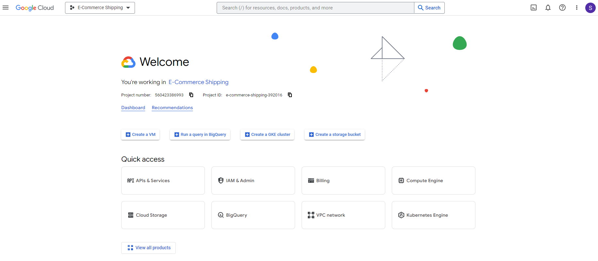 

We proceed on visiting the Google Storage tab on the upper left taskbar. There we choose to create a new Bucket. We set the unique name of the Bucket (mine is ecommerce_bucket_tutorial) and keep the rest information on default settings. After the creation, the bucket should be displayed on the tab's start-up page as an object.

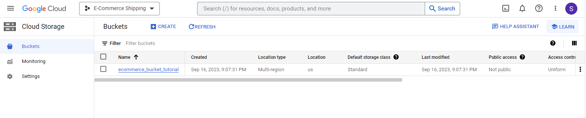 

Then, we visit the IAM & ADMIN tab from the upper left panel, and choose the Service Accounts tab. There we will create a service account that will enable us accessing the GCS Bucket we just created. To do so, click on "CREATE SERVICE ACCOUNT", give a name to the account and set the role to Cloud Storage Admin. The new service account should be displayed on the tab's starting page together with any other service accounts you might have created in the past:

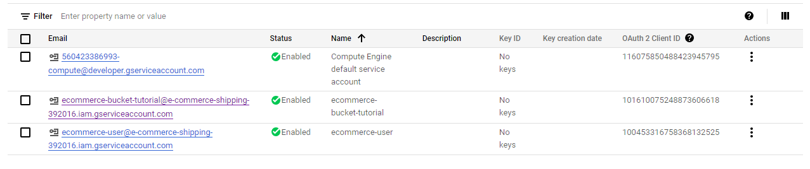 

Finally, we visit the created service account and go to the tab "KEYS". There we choose to create a new key in order to access the service account remotely. The key should be downloaded in json format on your local downloads folder and moved to your local project's directory. 

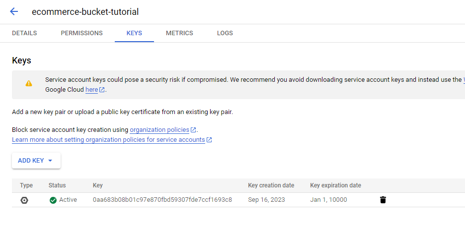 

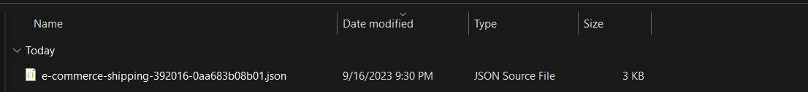 

### Uploading Data on GCS using Flow-as-a-Code 

We use dotenv library in order to install environment variables. The .env file to use is including:


```python
csv_name = "2019-Dec,2019-Nov,2019-Oct,2020-Jan,2020-Feb"
data_url = "https://www.kaggle.com/datasets/mkechinov/ecommerce-events-history-in-cosmetics-shop/download?datasetVersionNumber=6"
raw_path = "ecommerce-events-history-in-cosmetics-shop/"
parquet_path = "parquet_files/"
```

We are going to use the following code in Python in order to download data from Kaggle, transform them, save them locally as parquet files in a directory called "parquet_files" and finally upload them to GCS in a directory called "parquet_files". The library google.cloud is helping us to connect to the GCS Bucket using the key.json we downloaded before.


```python
# imports
import argparse
from time import time
import pandas as pd
from datetime import timedelta
import opendatasets as od
import os
from dotenv import load_dotenv
from google.cloud import storage
import pyarrow.parquet as pq
import pyarrow as pa


def extract_data(path: str) :
    # read each csv in chunks of 100000 rows 
    df_iter = pd.read_csv(path, iterator=True, chunksize=100000)
    df = next(df_iter)

    return df

def transform_data(i, df, parquet_path):
    # Set the datetime format, create new column date and drop a column that is full of Nulls
    df['event_time'] = pd.to_datetime(df['event_time'])
    df['date'] = df['event_time'].dt.date
    df = df.drop('category_code', axis=1)

    # Save the DataFrame as a Parquet file
    pq.write_table(pa.Table.from_pandas(df), f"{parquet_path}{i}")

    return df

def upload_to_gcs(i, parquet_path):
    # Initialize Google Cloud Storage client
    client = storage.Client.from_service_account_json('e-commerce-shipping-392016-0aa683b08b01.json')  # Replace with your JSON key file
    
    # Define your GCS bucket and object names
    bucket_name = 'ecommerce_bucket_tutorial'
    object_name = f'{parquet_path}{i}'  # Replace with your desired GCS object path
    
    # Upload the Parquet file to GCS
    bucket = client.bucket(bucket_name)
    blob = bucket.blob(object_name)
    blob.upload_from_filename(f'{parquet_path}{i}')

    print(f'Parquet file {parquet_path} uploaded to gs://{bucket_name}/{object_name}')


def download_data():
    od.download(os.getenv("data_url"))    

def main_flow(csv_name:str="2019-Dec.csv,2019-Nov.csv,2019-Oct.csv,2020-Jan.csv,2020-Feb.csv", raw_path:str="ecommerce-events-history-in-cosmetics-shop/", data_url:str="https://www.kaggle.com/datasets/mkechinov/ecommerce-events-history-in-cosmetics-shop/download?datasetVersionNumber=6", parquet_path:str="parquet_files/"):
    
    # Download dataset from Kaggle
    download_data()
    for i in csv_name.split(','):
        path = raw_path + i + ".csv"
        raw_data = extract_data(path)
        data = transform_data(i, raw_data, parquet_path)  # Pass the Parquet file path
        upload_to_gcs(i, parquet_path)  # Pass the Parquet file path


if __name__ == '__main__':
    load_dotenv()
    csv_name = os.getenv("csv_name")
    raw_path = os.getenv("raw_path")
    data_url = os.getenv("data_url")
    parquet_path = os.getenv("parquet_path")
    main_flow(csv_name, raw_path, data_url, parquet_path)
```

After running the script, the files should be uploaded on the GCS Bucket we created before.

 

### Querying GCS using BigQuery - Partitioning and Clustering

BigQuery is a fully-managed, serverless, and highly scalable data warehouse and analytics platform offered by Google Cloud. It is designed for running fast and SQL-like queries on very large datasets, making it ideal for data analysis, reporting, and business intelligence. Let's start by connecting BigQuery to our GCS Bucket and query some data. 

Firstly, visit the BigQuery tab from the upper left panel. On the left, a panel should open which includes the name of our project. Open it and from the 3 dots choose to create a new dataset.

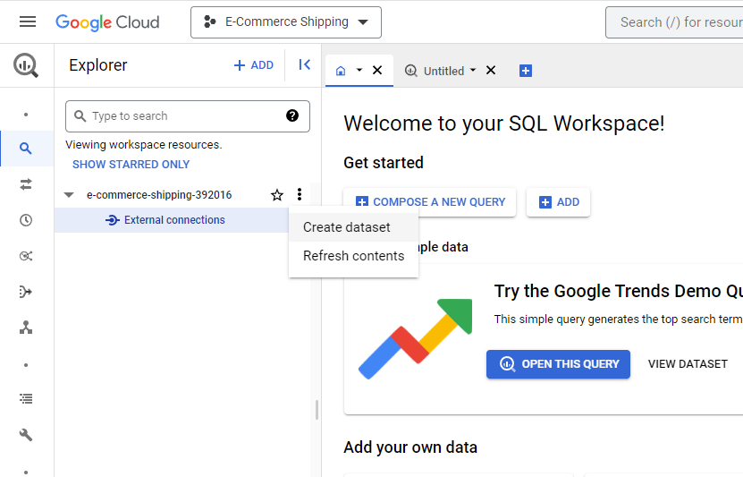 

There we choose GCS as our preferred source and we set the file name/names we want to include, the file format of the files, the name of the dataset we just created and the name of the table we are about to create. Here, i am selecting all the files inside the parquet_files directory.

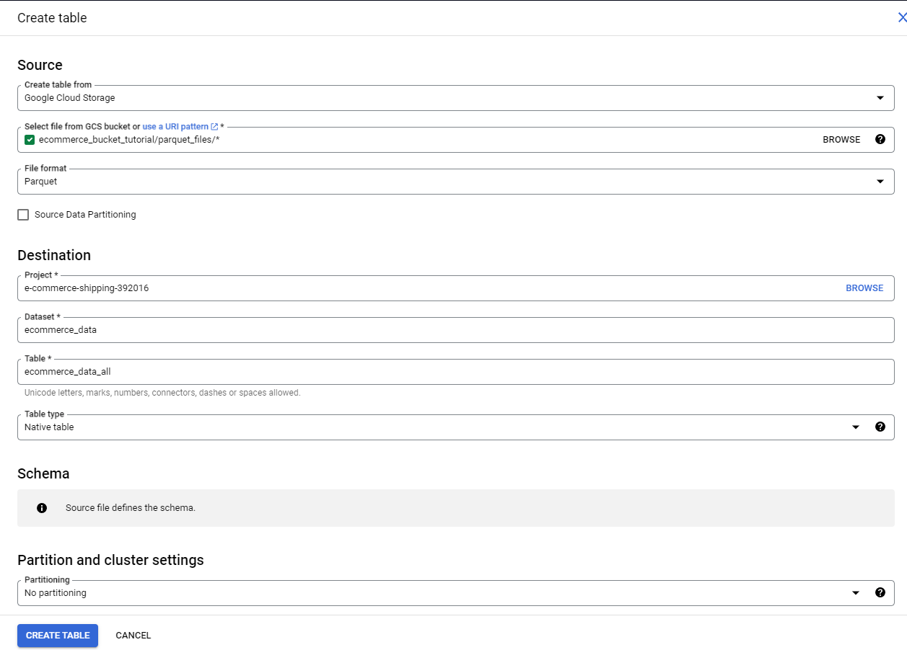 

The table should be loaded appending all the parquet files into a single table. We open the created Table and check the schema that BigQuery is using to read the table.

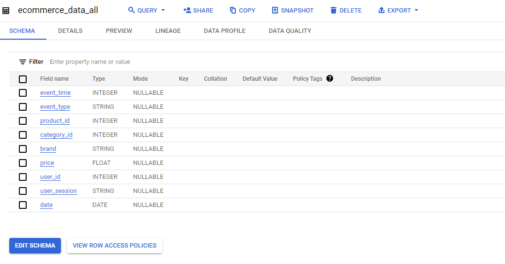 

We proceed by composing a new query using SQL.


```python
SELECT event_time, product_id, category_id, brand, price 
FROM `e-commerce-shipping-392016.ecommerce_data.2019-Dec` 
LIMIT 1000;
```

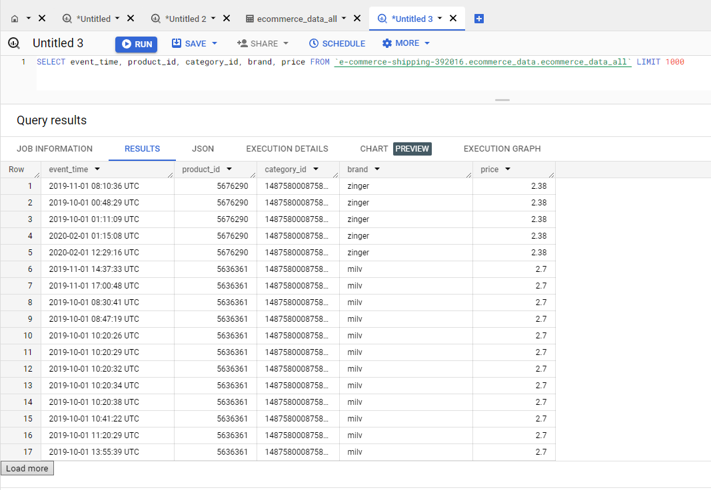 

Moreover, we perform an aggregated query:


```python
SELECT product_id, AVG(price) AS Average_Price FROM `e-commerce-shipping-392016.ecommerce_data.ecommerce_data_all` 
WHERE date = '2019-11-01'
GROUP BY product_id;
```

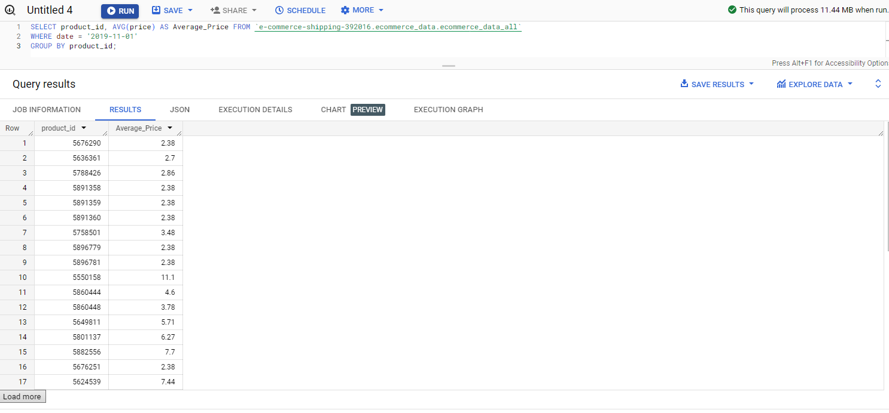 

At this point, it is important to talk about BigQuery's advantages. BigQuery is enabling us to Partition and Cluster our tables. BigQuery Partitioning and Clustering are two techniques used to optimize query performance and reduce costs when working with large datasets.

 

Partitioning involves dividing a large table into smaller, more manageable pieces based on a specific column or field. Each partition acts as a separate unit, and queries only need to process the relevant partitions, which can significantly improve query performance. You may partition a table by:

- Time-unit column: tables are partitioned based on a TIMESTAMP, DATE, or DATETIME column in the table.
- Ingestion time: tables are partitioned based on the timestamp when BigQuery ingests the data.
- Integer range: tables are partitioned based on an integer column.

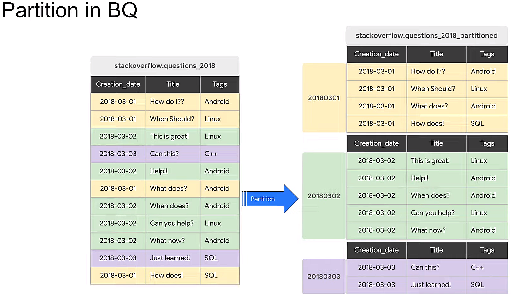

We will use the column "date" we generated in python, which is of type DATE, to create a new partitioned table.


```python
CREATE OR REPLACE TABLE ecommerce_data.ecommerce_data_all_partitioned
PARTITION BY date AS
SELECT * FROM e-commerce-shipping-392016.ecommerce_data.ecommerce_data_all; 
```

We perform again the aggregated query on the partitioned table and we observe that the amount of data processed by the query is now 2.29MB in contrast to the 14.11MB needed by the previous query.


```python
SELECT product_id, AVG(price) AS Average_Price
FROM `e-commerce-shipping-392016.ecommerce_data.ecommerce_data_all_partitioned`
WHERE date = '2019-11-01'
GROUP BY product_id
```

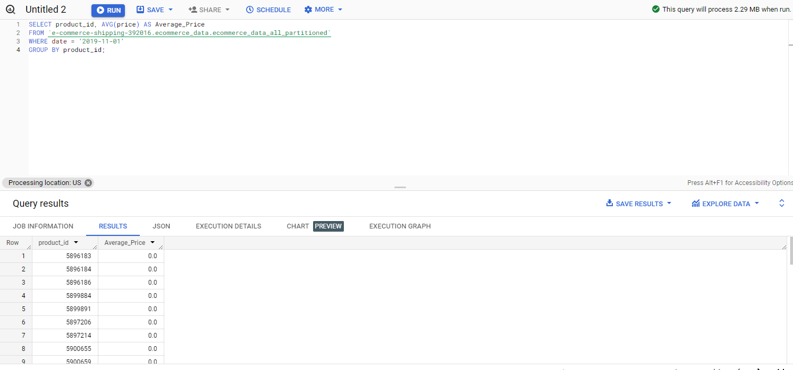

On the other hand, Clustering involves organizing the data within each partition based on the values in one or more columns. This improves query performance by physically grouping related data together, making it more efficient to retrieve. 

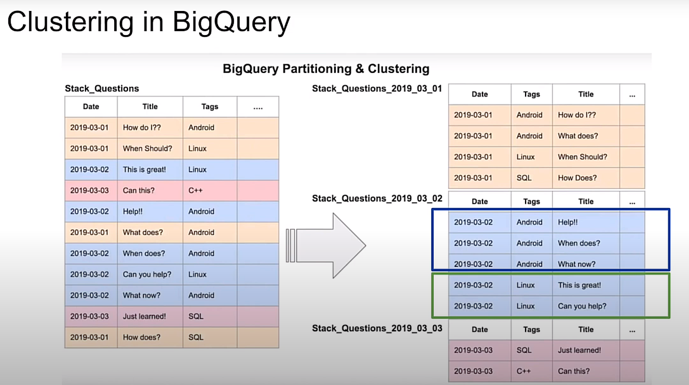

We create a new table that is partitioned by date and clustered by product_id.


```python
CREATE OR REPLACE TABLE `e-commerce-shipping-392016.ecommerce_data.ecommerce_data_all_partitioned_clustered`
PARTITION BY date
CLUSTER BY product_id AS
SELECT * FROM e-commerce-shipping-392016.ecommerce_data.ecommerce_data_all;
```

We observe again, that the amount of data that is processed is very small.

```python
SELECT product_id, AVG(price) AS Average_Price
FROM 'e-commerce-shipping-392016.ecommerce_data.ecommerce_data_all_partitioned_clustered'
WHERE date = '2019-11-01' and product_id = 5676290
GROUP BY product_id;
```

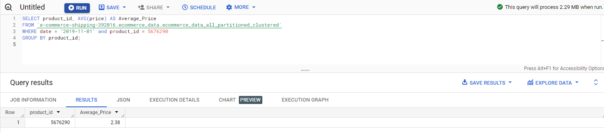

By effectively using Partitioning and Clustering we can increase the efficiency of our queries, making them faster and cost-effective.

### Conclusion

Throughout this tutorial, we've demonstrated how to set up GCS and BigQuery, how to seamlessly transfer data between them, and how to perform querying tasks with BigQuery. We've also covered best practices and tips to optimize your workflow, ensuring efficient data management and analysis. In future tutorials, we will explore BigQuery more, taking advantage of its Analytics and ML Pipeline capabilities.
