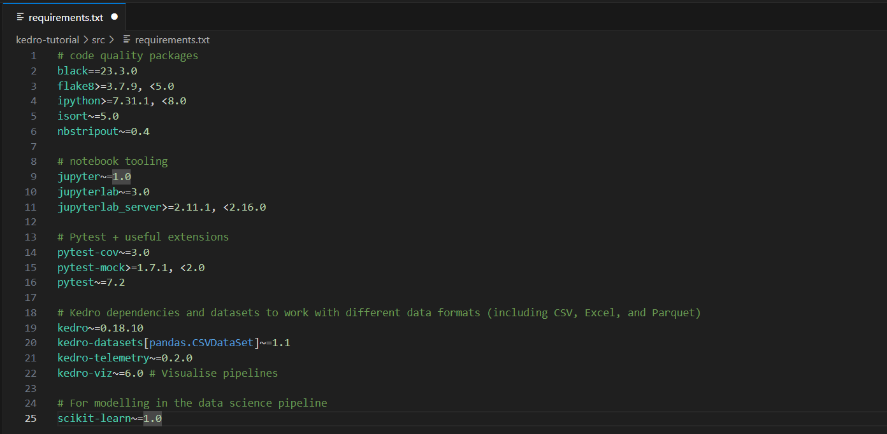

## Building ML Pipelines using Kedro

<!--
```python
from IPython.display import display, HTML
display(HTML('<div style="display: flex;"> \
              \
             <div style="float: right; margin-left:3%"> \
             <p style=" font-size: 130%; margin-top:10%; ">By Stamatis Sideris</p> \
             <p style="font-size: 100%;">Updated as of: June 6, 2023</p> \
             </div> \
             </div>'))
```
-->

<div style="display: flex;">                            <div style="float: right; margin-left:3%">              <p style=" font-size: 130%; margin-top:10%; ">By Stamatis Sideris</p>              <p style="font-size: 100%;">Updated as of: June 6, 2023</p>              </div>              </div>


--------------------------------------------------------------------------

### Table of Contents

[1. Introduction](#introduction)

[2. Virtual Environment Deployment](#virtual-environment-deployment)

[3. Kedro Installation and Git Initiallization](#kedro-installation-and-git-initiallization)

[4. Declaration of Dependencies](#declaration-of-dependencies)

[5. Data Set Up](#data-set-up)

[6. EDA using Jupyter Notebook](#eda-using-jupyter-notebook)

[7. Data Cleaning Pipeline Creation](#data-processing-pipeline-creation)

[8. Feature Engineering using Jupyter Notebook](#feature-engineering-using-jupyter-notebook)

[9. Data Science Pipeline Creation](#data-science-pipeline-creation)

[10. Project's Visualization](#project's-visualization)

[11. Project's Packaging](#project's-packaging)

[12. Conclusion](#conclusion)

### Introduction

In the realm of machine learning, the ability to efficiently develop, deploy, and maintain robust pipelines is crucial for successful data-driven projects. However, the complexity of managing data, models, and dependencies often poses significant challenges for data scientists and engineers. Enter Kedro, a powerful open-source framework that streamlines the development of reproducible, scalable, and maintainable end-to-end machine learning pipelines. For more info refer here: [kedro.org](https://kedro.org)

If you're ready to enhance your machine learning workflows, join us as we dive into the world of Kedro. By the end of this article, you'll have the knowledge and confidence to build ML pipelines that are robust, maintainable, and optimized for success.

### Virtual Environment Deployment

Like many other languages Python requires a different version for different kind of applications. The application needs to run on a specific version of the language because it requires a certain dependency that is present in older versions but changes in newer versions. Virtual environments makes it easy to ideally separate different applications and avoid problems with different dependencies. Using virtual environment we can switch between both applications easily and get them running.

There are multiple ways of creating an environment using virtualenv, venv and conda. Conda command is preferred interface for managing installations and virtual environments with the Anaconda Python distribution.

To do so, we first need to install Anaconda. For the installation refer [here](https://github.com/ssideris/Data_Management_Concepts/tree/main/DevOps/Containerized%20ETL%20Procedures%20for%20Local%20Infrastructures%20using%20Python%2C%20Docker%20%26%20Docker%20Compose#anaconda-installation). 

Before starting with the deployment of the VE I would like to present a little tip. In case your path to the project is very long, you could use the following method to minize it and display only the name of the last folder in the path. Firstly, use the command $profile and then open the file that was provided using Visual Studio Code or any other source code editor. 


Inside the file add the following script. The code you added to your PowerShell profile (profile.ps1) modifies the prompt function. It changes the default prompt format to include the current VE and directory (folder) you are in.


```python
function prompt {
    $ve = ''
    $condaEnv = (conda info --json | ConvertFrom-Json).active_prefix
    if ($condaEnv) {
        $ve = "(conda: $($condaEnv.split('\')[-1])) "
    }

    $p = Split-Path -leaf -path (Get-Location)
    "$ve@$p -> "
}
```


The result is presented below:


For the creation of the VE, we will use conda. To cerate the environment and set its name and the python version we want it to support, we run:


```python
conda create --name kedro-tutorial python==3.10
```

To check if the VE has been created, we run:


```python
conda info --envs 
```


We proceed to activate the VE. The name of the VE should be presented at the start of the terminal line.


```python
conda activate kedro-tutorial
```


The instance is running!

### Kedro Installation and Git Initiallization

To install kedro, we run the following commands. The version running is the 0.18.10.

pip install kedro

kedro -V


We proceed by creating a new kedro project naming it "kedro-tutorial".


```python
kedro new
```

We observe that a new folder "kedro-tutorial" is created in our parent directory, where other folders are included. They are the default folders for configuring a kedro project and we will analyze their use on the next steps.


Finally, let's initiallize git for version controlling of our project. We enter the kedro project's directory and run the "git init" command.


```python
cd kedro-tutorial

git init
```

We configure git with our name and email for commits.


```python
git config --global user.name "Stamatis"

git config --global user.email "stamatisgsideris@gmail.com"
```

Then, we connect our git to a Github Repository using the https authentication method.

git remote add origin <repository-url>

Finally, we add the the files we want to push to our initial commit, we commit the changes/files with a meaningful commit message and we push the changes/files to our Github Repo and the branch "main".


```python
git add .

git commit -m "Initial commit"

git push -u origin main
```


Our project is ready to start!

### Declaration of Dependencies

We will use a number of different libraries during the project. In order to install them, we will use a requirements.txt file where we will include the names and versions of the libraries we need to install. Kedro has already produced such a file in the src directory including all the basic dependencies needed to run a kedro project. 



In order to install they dependencied we run the following command:


```python
pip install -r requirements.txt
```

### Data Set Up

Firstly, we need to upload the raw datasets we are about to use in the kedro project. To do so, we download the dataset from the following [link](https://www.kaggle.com/datasets/shree1992/housedata?select=data.csv) and move the data.csv to the data/01_raw/ directory.

Secondly we need to configure the dataset and its directory so that it is reachable. The conf directory is responsible for the configuration files. There, inside the base folder, three .yml files exist. We use the catalog.yml file to configure the data.csv by adding the following script:


```python
houses:
  type: pandas.CSVDataSet
  filepath: data/01_raw/data.csv
```


The catalog.yml will be responsible to configure all the inputs/outputs of our pipeline and make them available for analysis minimizing the size of the commands needed to call them and leading to clearer code. 

In order to read the data we will use ipython, an interactive shell for Python that provides enhanced functionality compared to the standard Python shell. To do so:


```python
kedro ipython

catalog.load("houses").head(10)
```


To exit ipython type "exit".

### EDA using Jupyter Notebook

Usually, one of the first things to do in a Data Science project is to perform exploratory data analysis in your data. The most commonly used tool to do this is Jupyter Notebook. Kedro provides a notebooks directory to store all of the produced notebooks. To create a Jupyter Notebook via Kedro use the following command:


```python
kedro jupyter notebook
```

You should be redirected to the Jupyter Notebook page. Enter the notebooks directory and create a new kedro notebook there. Save and name it, i called it "EDA.ipynb".


There we will run the explonatory data analysis. For the code refer in the folder notebooks. In this tutorial, we will not pay attention to the cleaning performed to our dataset as the main purpose is to show how kedro can operate as a main storage and orchestrational point for all data science teams to work on. One point to mention is that all the diagrams produced and saved in the Jupyter Notebook can be stored inside the notebooks directory. To access one use the following command: 


```python
start variables_cor.png
```


### Data Cleaning Pipeline Creation

We proceed by creating our first pipeline which will be responsible to clean our raw dataset based on the cleaning that was discovered that is needed at the EDA. Automatically, the new pipeline is saved inside the path kedro_tutorial/tests/pipelines together with two more files, the __init__.py and the test_pipeline.py.


```python
kedro pipeline create data_cleaning  
```


We create a new nodes.py inside the pipelines/data_processing folder. There we create a new node that is cleaning the raw data. Each node has the form of a python function with a defined input and output. Any necessary imports could be performed inside the nodes.py. 


```python
import pandas as pd

def clean_data(data: pd.DataFrame) -> pd.DataFrame:
    data_clean = data.dropna()
    data_clean = data_clean[data_clean['price'] != 0]

    return data_clean
```


Moreover, we open the test_pipeline.py. There we create our pipeline in which we want to include the node we created before.


```python
from kedro.pipeline import Pipeline, node, pipeline
from .nodes import clean_data


def create_pipeline(**kwargs) -> Pipeline:
    return pipeline([node(
        func=clean_data,
        inputs="data",
        outputs="cleaned_data",
        name="clean_data_node",
    ), ])
```


Furthemore, we visit the __init__.py in order to initialize the pipeline creation when we run kedro.


```python
from .pipeline import create_pipeline

__all__ = ["create_pipeline"]

__version__ = "0.1"
```


As a final step, we configure the clean dataset (output) inside the catalog.yml file in order to make it callable from anywhere inside kedro.


```python
cleaned_data:
  type: pandas.CSVDataSet
  filepath: data/02_intermediate/cleaned_data.csv
```


To run and test our cleaning pipeline we could run the following command:


```python
kedro run 
```

and to test only the cleaning node (function), we could run:


```python
kedro run --nodes=clean_data
```

The result is the same as we only have one pipeline running which includes only one node.


### Feature Engineering using Jupyter Notebook

As a pre-step, we will create a typical jupyter notebook that will analyze the cleaned dataset and transform data so that they are ready for the ML model, as it is usually happening on a data science project. Moreover, it will train and test models on a variety of methods and evaluate them. We will not proceed on fine tuning the winning model as it is not the purpose of this tutorial. The file named Feature_engineering.ipynb is saved in the notebooks directory.


### Data Science Pipeline Creation

On this step, we will create a data science pipeline that will deploy our Feature_engineering notebook into production.


Firstly, we create a node that does the necessary cleaning and processing on features such as dropping columns or scaling and one-hot-encoding numeric columns. The node is created via the processing function while the other functions work supportively to the node.


```python
import pandas as pd
from sklearn.preprocessing import MinMaxScaler, OneHotEncoder

def drop_cols(data: pd.DataFrame) -> pd.DataFrame:
    processed_data = data.drop(['date', 'sqft_above', 'bathrooms', ], axis=1)
    return processed_data


def scale(data: pd.DataFrame, num_cols: list) -> pd.DataFrame:
    # scale numeric
    processed_data[num_cols] = MinMaxScaler().fit_transform(data[num_cols])
    return processed_data


def one_hot_encode(data: pd.DataFrame, cat_cols: list) -> pd.DataFrame:
    # one-hot-encode categorical
    encoder = OneHotEncoder(sparse_output=False, handle_unknown='ignore').fit(
        data[cat_cols])
    encoded_cols = encoder.get_feature_names_out(cat_cols)
    encoded_data = encoder.transform(processed_data[cat_cols])
    # Create a DataFrame with the encoded columns
    processed_data_encoded = pd.DataFrame(encoded_data, columns=encoded_cols)
    processed_data = pd.concat([data, processed_data_encoded], axis=1)
    return processed_data


def processing(data: pd.DataFrame) -> pd.DataFrame:
    processed_data = drop_cols(data)
    num_cols = [col for col in processed_data.columns if processed_data[col].dtype in [
        'float64', 'int64']]
    cat_cols = [col for col in processed_data.columns if processed_data[col].dtype not in [
        'float64', 'int64']]
    processed_data = scale(processed_data, num_cols)
    processed_data = one_hot_encode(processed_data, cat_cols)

    return processed_data

```

Secondly, we create a node that splits the processed data into training and testing datasets. Here, we will add the parameter "parameters" which will look inside the conf/base/parameters folder for the data_science.yml. There we will configure a dictionary with all the parameters that we will use in the splitting, training and testing of our model such as the test size, the random state or any feature inside the dataset. This helps us on keeping our code clear and the parameterization process easily convertable.


```python
from sklearn.model_selection import train_test_split
from typing import Dict, Tuple

def split_data(data: pd.DataFrame, parameters: Dict) -> Tuple:
    X = data.drop("price", axis=1)
    y = data["price"]
    X_train, X_test, y_train, y_test = train_test_split(
        X, y, test_size=parameters["test_size"], random_state=parameters["random_state"]
    )
    return X_train, X_test, y_train, y_test
```

The yaml configuration:


```python
model_options:
  test_size: 0.3
  random_state: 3
```


Finally, we create two more nodes, one for the training and one for the evaluation of the model.


```python
def train_model(X_train: pd.DataFrame, y_train: pd.Series) -> LinearRegression:
    regressor = LinearRegression()
    regressor.fit(X_train, y_train)
    return regressor


def evaluate_model(
    regressor: LinearRegression, X_test: pd.DataFrame, y_test: pd.Series):
    predicted = regressor.predict(X_test)
    score = np.sqrt(mean_squared_error(y_test, predicted))
    logger = logging.getLogger(__name__)
    logger.info("Model has RMSE equal to %.3f on test data.", score)
```

All the nodes together should look similar to this:


Let's configure the inputs and outputs of the pipeline so that they are easily accesible via the catalog.yml. With the following configuration we configure the processed data that are used as input to the model to the data/03_primary directory and the trained model "regressor" to the data/06_models directory. We use the "versioned: true" parameter to keep version controlling over the model every time it is running.


```python
model_input_table:
  type: pandas.CSVDataSet
  filepath: data/03_primary/processed_data.csv

regressor:
  type: pickle.PickleDataSet
  filepath: data/06_models/regressor.pickle
  versioned: true
```


As of the nodes' sequence, we open the pipeline.py and we add the nodes to the pipeline configuring them to the appropriate function, inputs and outputs as well as a name for the node. Kedro understands the sequence to run the nodes from the inputs and outputs they depend on, so each node will not run until their inputs have been produced and configured in the catalog.yml from another node.


```python
from kedro.pipeline import Pipeline, node, pipeline
from .nodes import processing, split_data, train_model, evaluate_model

def create_pipeline(**kwargs) -> Pipeline:
    return pipeline([node(
        func=processing,
        inputs="cleaned_data",
        outputs="model_input_table",
        name="process_data_node",
    ), node(
        func=split_data,
        inputs=["model_input_table", "params:model_options"],
        outputs=["X_train", "X_test", "y_train", "y_test"],
        name="split_data_node",
    ), node(
        func=train_model,
        inputs=["X_train", "X_test"],
        outputs="regressor",
        name="train_model_node",
    ), node(
        func=evaluate_model,
        inputs=["regressor", "X_test", "y_test"],
        outputs=None,
        name="evaluate_model_node",
    ), ])
```


Finally, we initialize the pipeline creation.


```python
from .pipeline import create_pipeline

__all__ = ["create_pipeline"]

__version__ = "0.1"
```


Let's run the whole project and see what is produced.


```python
kedro run
```


All the nodes run smoothly. The trained model is stored in the data/06_models directory. We run the project one more time and we observe that a version control is kept for the models trained. This way we can easily change the parameters yaml file and rerun our project or train our model on different sizes of datasets without losing count of the models produced.


Also, we are able to run each pipeline created individually so that we do not have to clean our dataset another time. For example we might want to change some of the model's parameters in the yaml file to create a new version of the model. To run a specific pipeline we use:


```python
kedro run --pipeline data_science
```


### Project's Visualization

Kedro offers an interactive UI to visualize your project pipelines and get a better understanding of the underground processes. To visualize your project just use this command:


```python
kedro viz
```

A new browser window should open where a dendrogram shows the nodes and the sequence of visiting them when we run our project. We can interact with each node getting information about it and the code it includes.


### Project Packaging

As soon as the project is ready, we should find a way in order to package it and make it available for the people of interest. To do so, we will use Docker. Docker is a tool that makes it easier to create, deploy and run applications. It uses containers to package an application along with its dependencies and then runs the application in an isolated virtualised environment.

Configuring a Docker container environment may become complex and tedious, for an example you might refer to these tutorials [Deployment of Local Containerized Relational Database using PostgreSQL & Docker](https://github.com/ssideris/Data_Management_Concepts/tree/main/DevOps/Deployment%20of%20Local%20Containerized%20Relational%20Database%20using%20PostgreSQL%20%26%20Docker) and [Containerized ETL Procedures for Local Infrastructures using Python, Docker & Docker Compose](https://github.com/ssideris/Data_Management_Concepts/tree/main/DevOps/Containerized%20ETL%20Procedures%20for%20Local%20Infrastructures%20using%20Python%2C%20Docker%20%26%20Docker%20Compose). Kedro-Docker significantly simplifies this process and reduces it to 2 steps:

1) Build a Docker image

2) Run your Kedro project in a Docker environment

To install kedro:


```python
pip install kedro-docker
```

To initiallize docker use:


```python
kedro docker init
```

This command will generate Dockerfile, .dockerignore and .dive-ci files for your project.

In order to build a Docker image for your project, navigate to the project's root directory and then run the following from the command line:


```python
kedro docker build
```

Behind the scenes Kedro does the following:

Creates a template Dockerfile and .dockerignore in the project root directory if those files don't already exist

Builds the project image using the Dockerfile from the project root directory

The project Docker image will automatically be tagged as <project-root-dir>:latest, where <project-root-dir> is the name of the project root directory. To change the tag, you can add the --image command line option, for example:


```python
kedro docker build --image house_pricing
```

Once the project image has been built, you can run the project using a Docker environment:


```python
kedro docker run --image house_pricing
```


To visualize the project inside the container run the following commands:


```python
pip download -d data --no-deps kedro-viz
kedro docker build
kedro docker cmd bash --docker-args="-it -u=0 -p=4141:4141"
pip install data/*.whl
kedro viz --host=0.0.0.0 --no-browser
```

And then open 127.0.0.1:4141 in your preferred browser. Incidentally, if kedro-viz is already installed in the Docker container (via requirements) then you can run:


```python
kedro docker cmd --docker-args="-p=4141:4141" kedro viz --host=0.0.0.0
```

Your project is ready to be used by anyone with access to the docker container!

### Conclusion

By following this tutorial, you have gained a solid understanding of the benefits of using Kedro, such as its modular and scalable approach, which promotes code reusability and collaboration. You have learned how to set up a Kedro project, define data pipelines, and leverage Kedro's extensive functionality for data engineering, model training, and evaluation as well as how to containerize the project and deploy it in production.

As you continue your journey with Kedro, I encourage you to explore its vast ecosystem and discover additional features and plugins that can further enhance your pipeline development experience. I will try and keep the repo up to date by updating it with new kedro methods and best practises.
